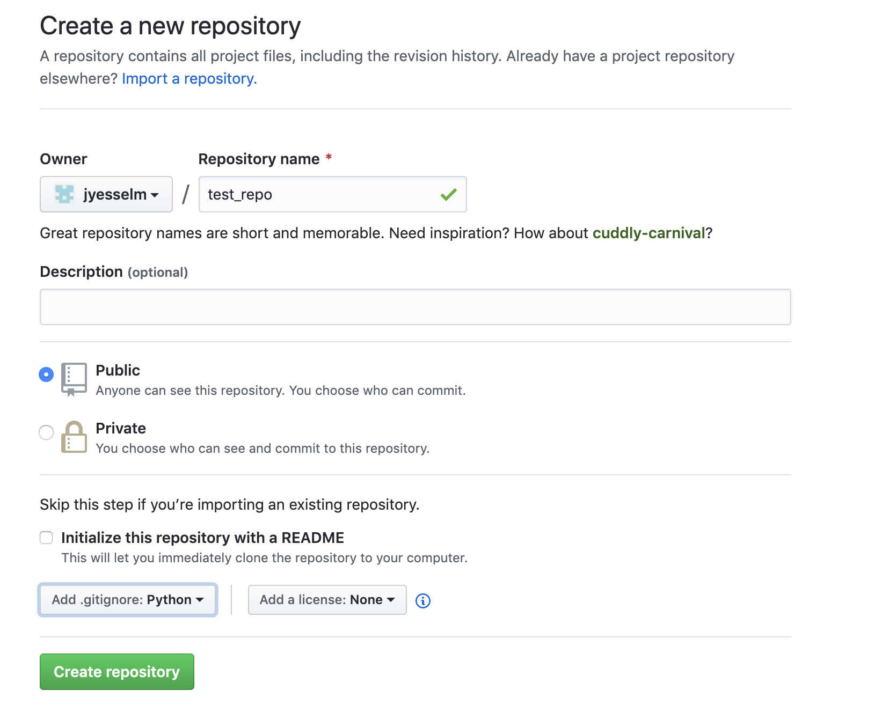
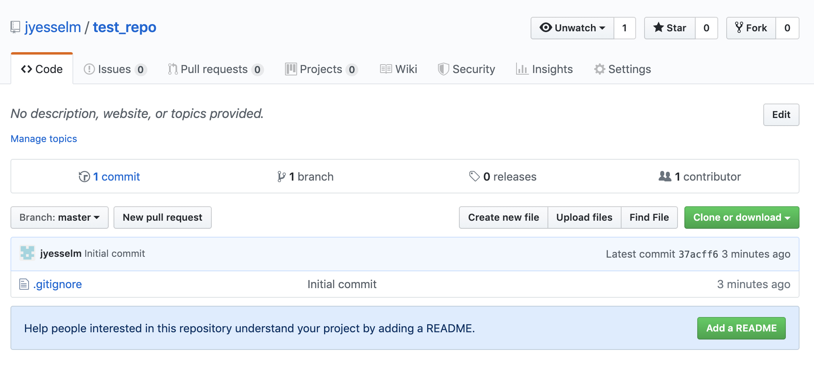
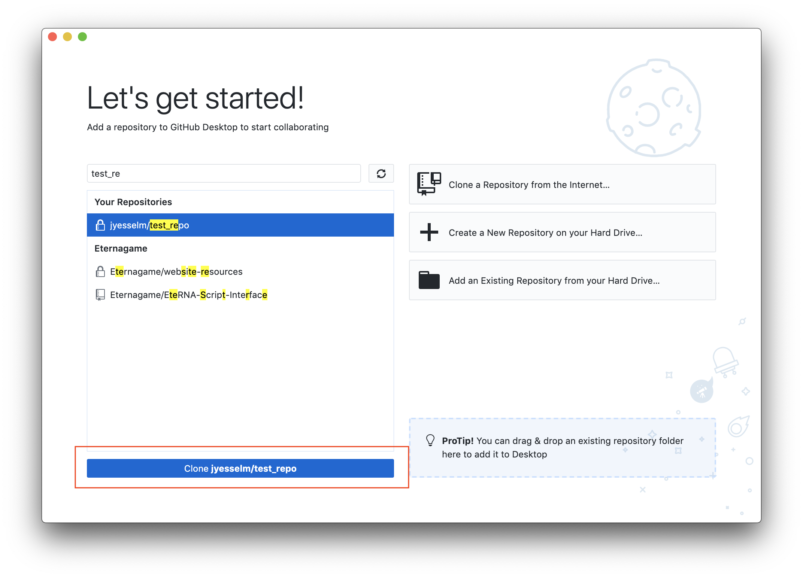
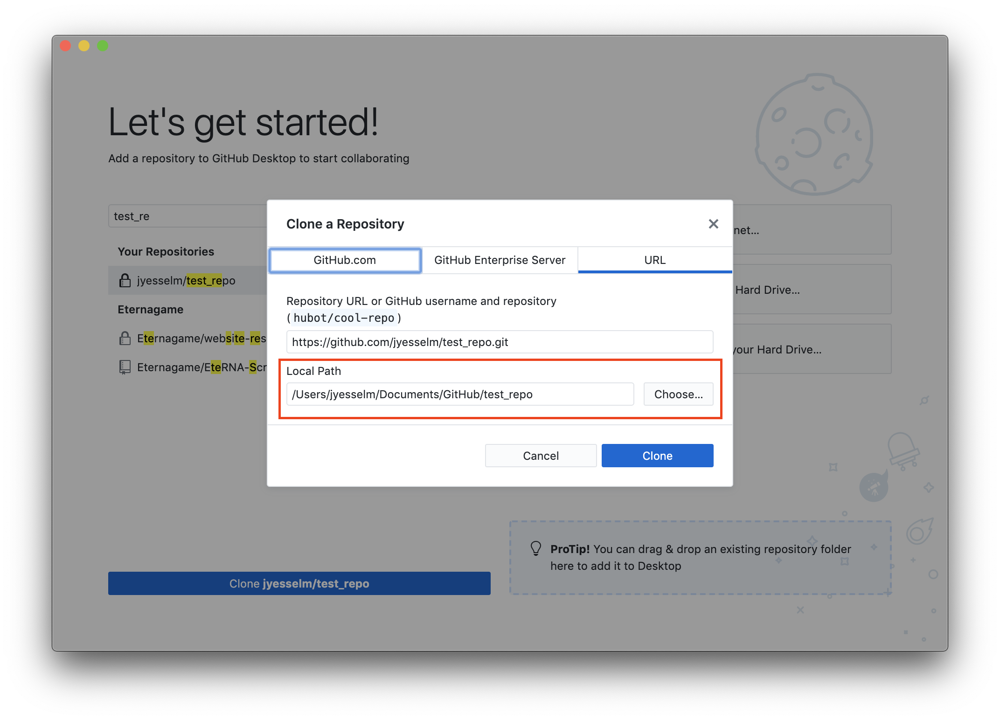
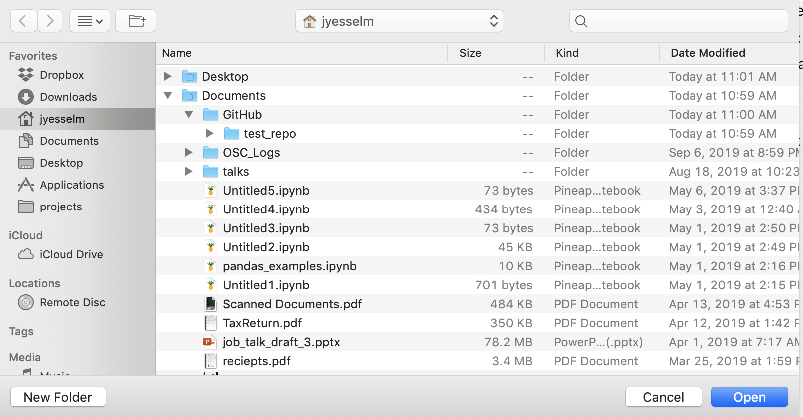
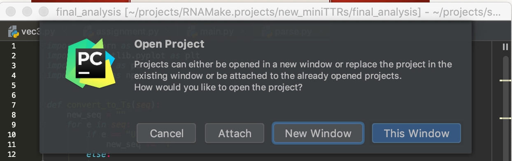
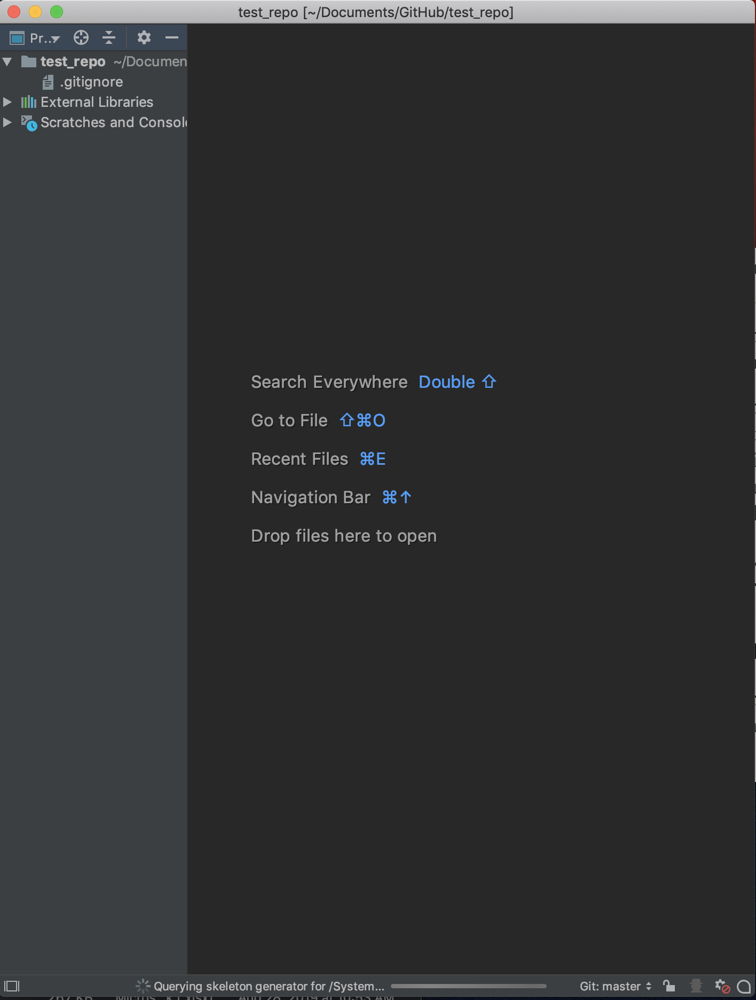
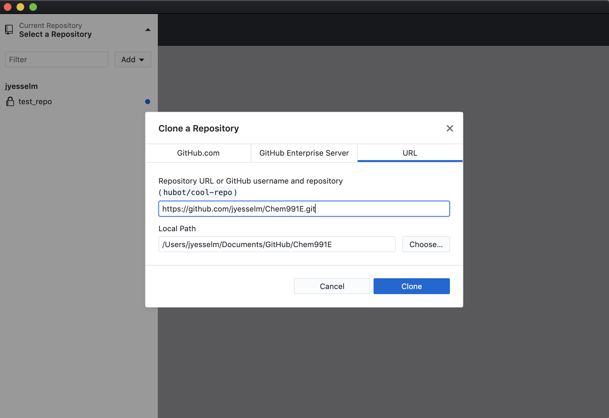

# Lesson 8: The revenge of git

Git is a version control system of code projects. Basically it allows you to save and share your progress with other people, and work together on large projects. It also allows you to revert to older versions of your code if you made a mistake, or to make changes and not affect your release version. 

## Setting up git 

For mac and linux it should already be setup. Although if you wish ther are graphical versions of it too. 

Download the windows version here: https://git-scm.com/downloads

## Creating a new github repo 

Go to github and click "New" the green button 

After you fill everything out and click "Create repository"

Here is an empty repo, now we will go over the basic git commands

## How to use Git Desktop

Login with your github user name and find the git repo you just created. All your repositories should be listed there. When you find it go to the bottom and click on "clone repo_name". Note that if this is not your first repo to clone, go to file -> clone repository. 

When you click on clone you will get a new menu that comes up that asks where you want the local version of this repo to be on your computer. Please take note of the location. I think the default is "Documents/GitHub/repo_name". Note that if you have a repo with the same name it will not allow you to override it. Pick a new directory name or delete the old repo.

Open up PyCharm and go to file -> open. Navigate to where the repo was stored. Here is where the repo is stored for me. I think for Windows it is also in "Documents/GitHub/repo_name". Make sure to click on "test_repo" do not go into the directory. Hit open.

When prompted, pick "New Window"

This is what your PyCharm project window should look like

Now lets go back to the Git Desktop to get the class git directory. Click on "Current Repository" on the top left and hit "Add" to clone a new repo. For the location put in "https://github.com/jyesselm/Chem991E". Press clone.

Now we are going to get the files for project from the class git folder. You can go directly to the git directory using "Show in Finder"

