Lesson 8: The revenge of git

Git is a version control system of code projects. Basically it allows you to save and share your progress with other people, and work together on large projects. It also allows you to revert to older versions of your code if you made a mistake, or to make changes and not affect your release version. 

## Setting up git 

For mac and linux it should already be setup. Although if you wish ther are graphical versions of it too. 

Download the windows version here: https://git-scm.com/downloads

## Creating a new github repo 

Go to github and click "New" the green button 

After you fill everything out and click "Create repository"

Here is an empty repo, now we will go over the basic git commands

## How to use Git Desktop

Login with your github user name and find the git repo you just created. All your repositories should be listed there. When you find it go to the bottom and click on "clone repo_name". Note that if this is not your first repo to clone, go to file -> clone repository. 

When you click on clone you will get a new menu that comes up that asks where you want the local version of this repo to be on your computer. Please take note of the location. I think the default is "Documents/GitHub/repo_name". Note that if you have a repo with the same name it will not allow you to override it. Pick a new directory name or delete the old repo.

Open up PyCharm and go to file -> open. Navigate to where the repo was stored. Here is where the repo is stored for me. I think for Windows it is also in "Documents/GitHub/repo_name". Make sure to click on "test_repo" do not go into the directory. Hit open.

When prompted, pick "New Window"

This is what your PyCharm project window should look like

Now lets go back to the Git Desktop to get the class git directory. Click on "Current Repository" on the top left and hit "Add" to clone a new repo. For the location put in "https://github.com/jyesselm/Chem991E". Press clone.

Now we are going to get the files for project from the class git folder. You can go directly to the git directory using "Show in Finder"

Here are where the files are located. "Documents/GitHub/Chem991E/07_introduction_to_git/class_assignment". Copy the four python files to your new repo.

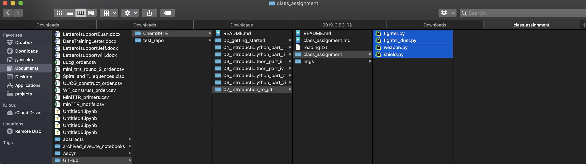

So now there should only be the 4 python files in your repo. As seen below. 

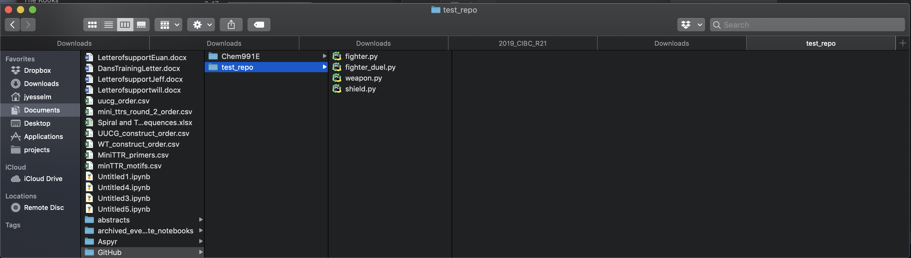

Now go back to your PyCharm window and update the project files using the syncronize command which you find when you right click on the folder.

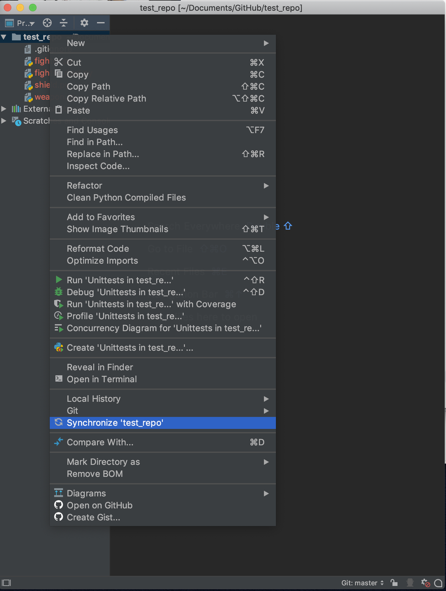

This is what your PyCharm project window should look like now.

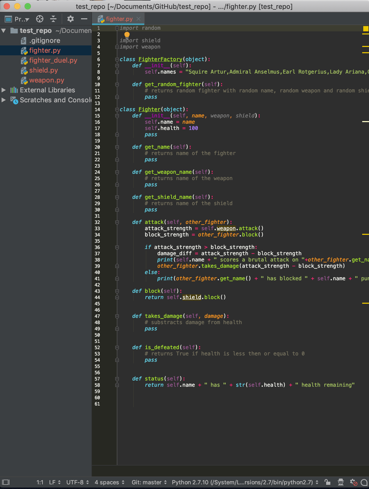

Now lets go back to Git Desktop and commit these changes. When you get back to the Git Desktop window you should see something like this. There are these extra files that PyCharm uses to keep track of your project. You don't need to add these, shoul you can highlight them and hit "Ignore all .xml files" or "Ignore 6 Selected Files" either works.

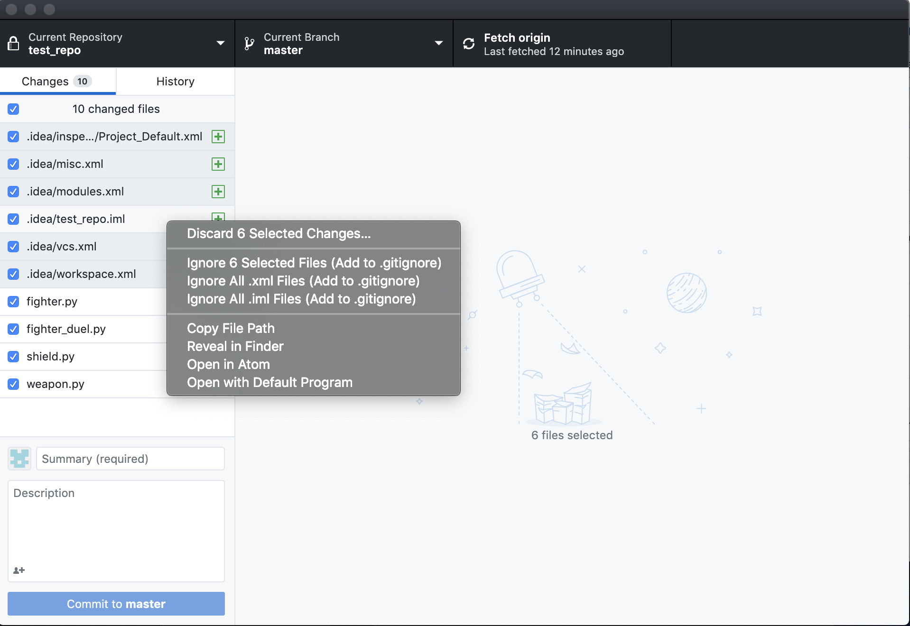

Now your Git Desktop window should look like this. The only files that are being changed/added are on below. Press "Commit to master"

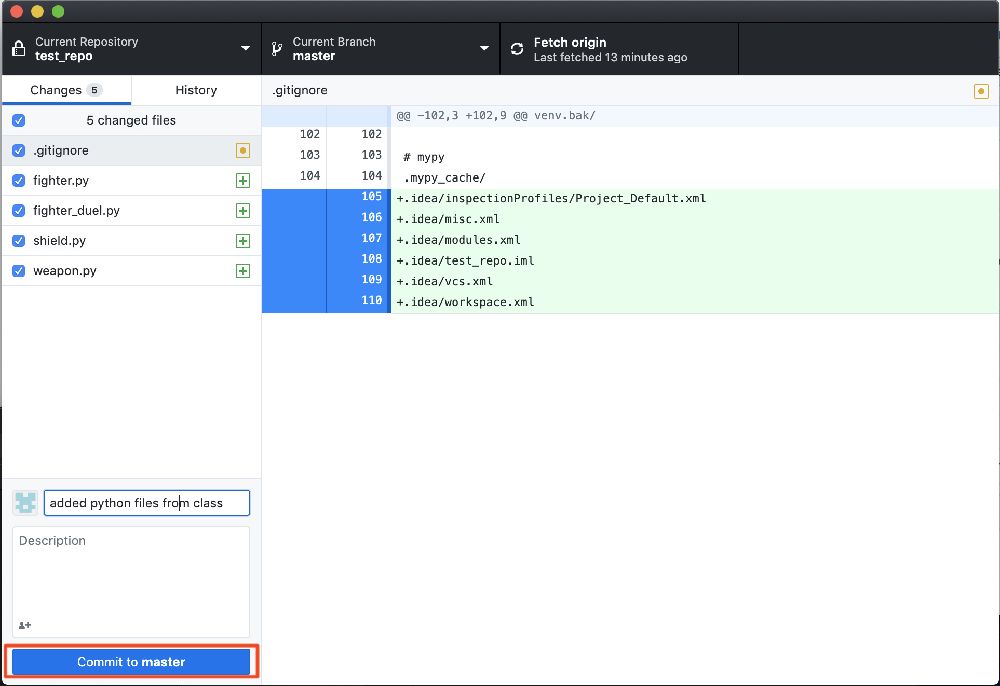

Finally push changes to github with "Push origin"

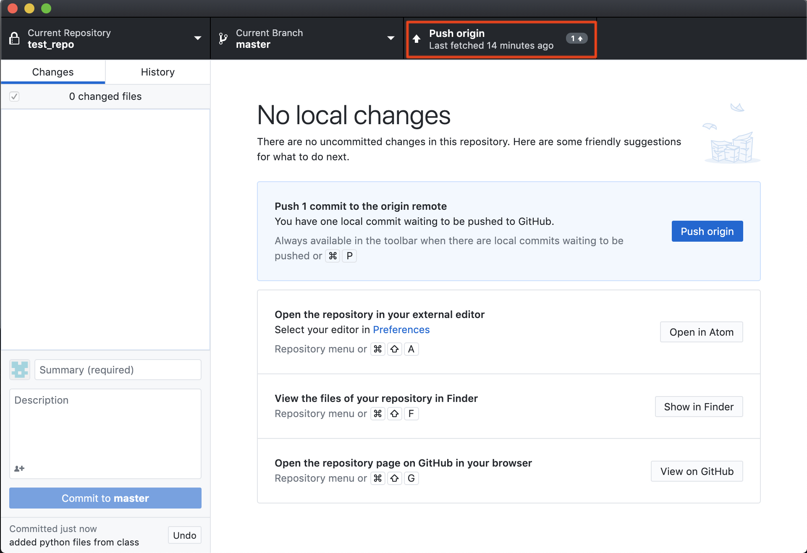

You can now view the changes on github

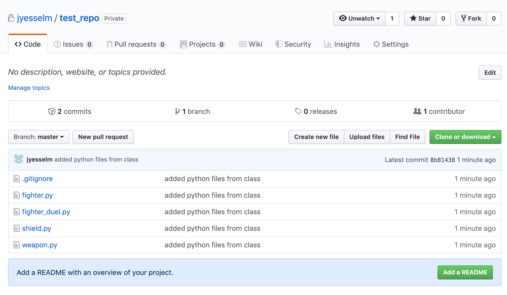

## Working with multiple branches

When you are working with someone else do NOT work on master. Instead make a new branch make your changes then. Pull from master and then merge your changes into master and push

Making a new branch, click on "Create New Branch"

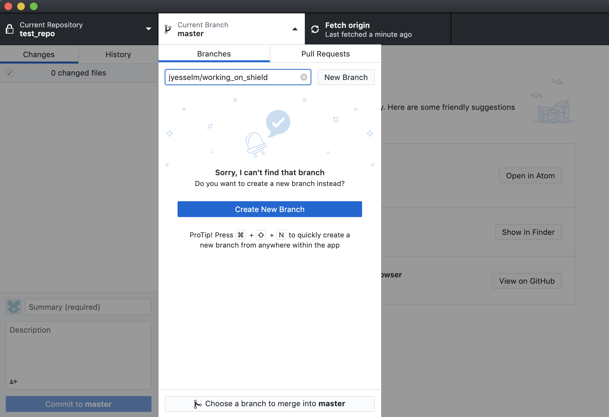

The branch does not exist so click in "Create Branch"

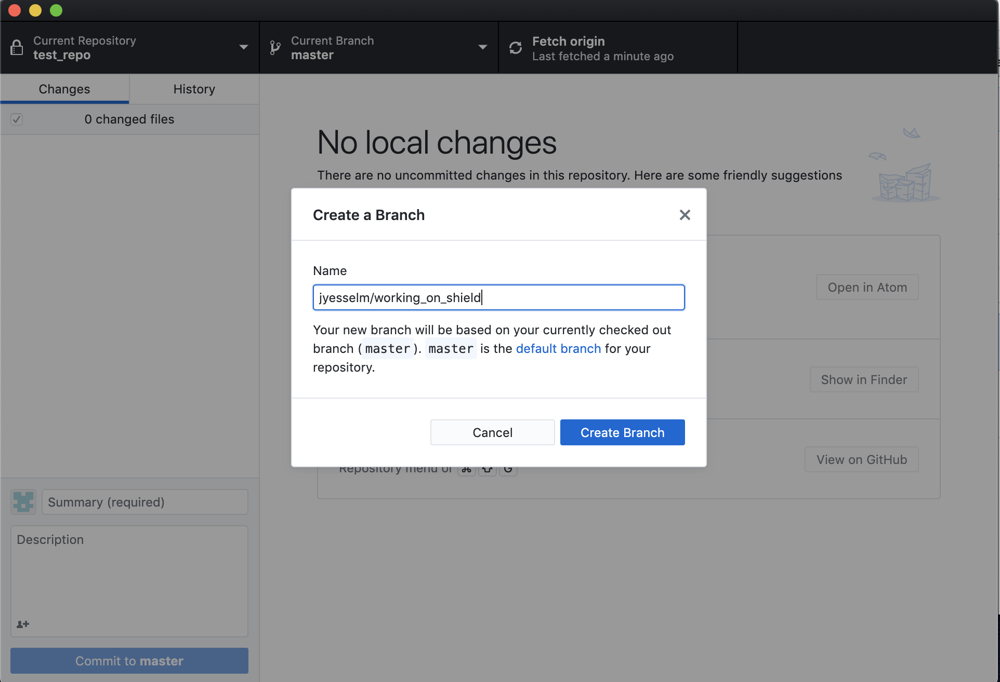

Go back to PyCharm and make your changes, in this case I am going to implement changes to shield. Notice that after I make my edits "shield.py" is now blue indicating I have made changes that are not committed to the repo.

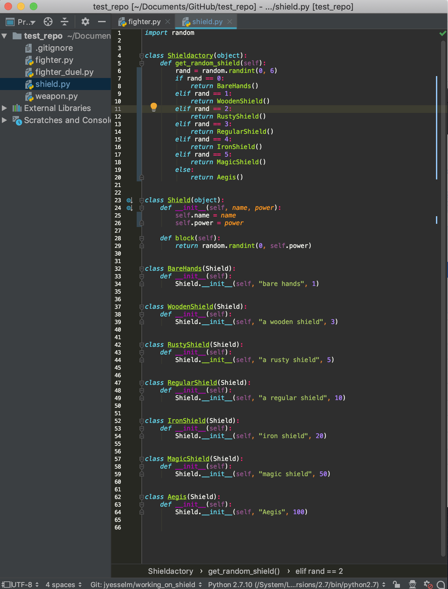

Go back to Git Desktop and now you can see the changes highlighted that I have added. Go ahead and add a msg and press "Commit"

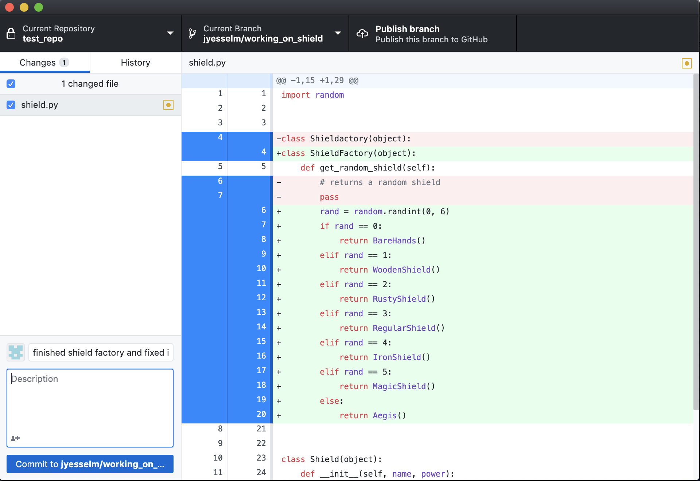

Go to "Current Branch" and switch back to master branch by clicking on it

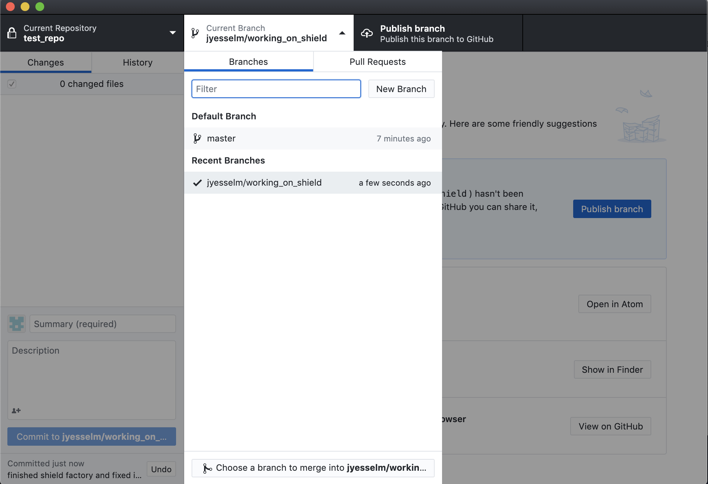

Lastly before we merge, fetch origin to make sure we get all the changes in the top right, and then go to branches and click at the bottom merge into master. Press "Merge"

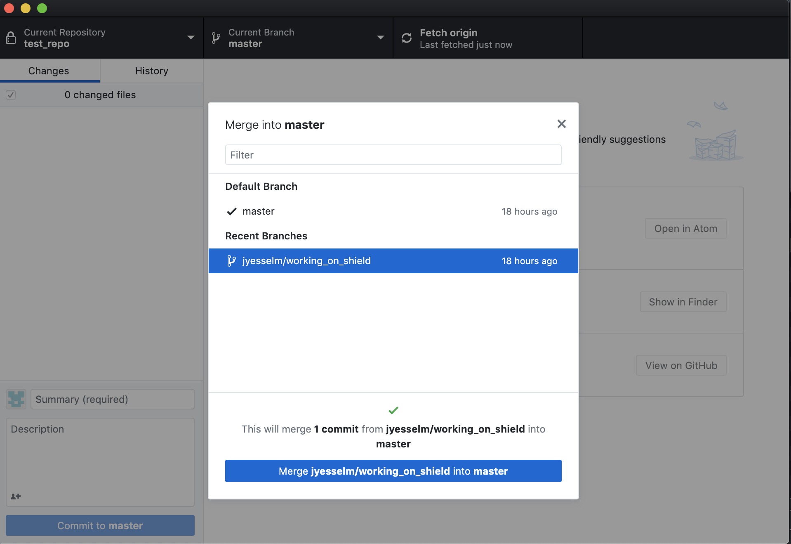

Now go and push these changes to origin by clicking on "Push origin"

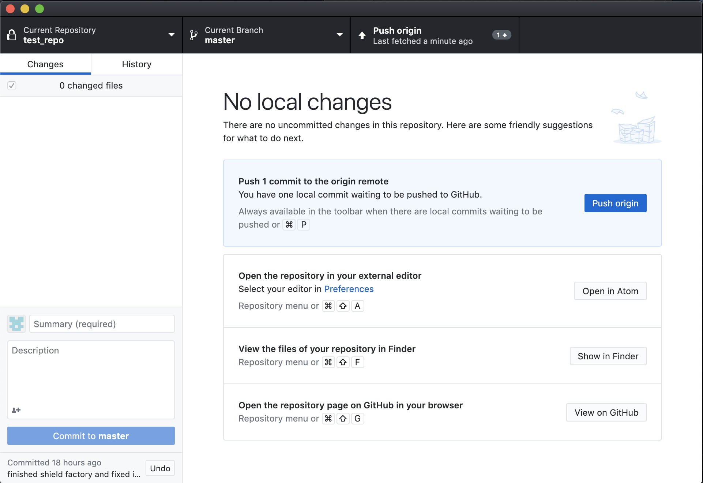

And thats it! Now lets just delete the branch we made and we are done.

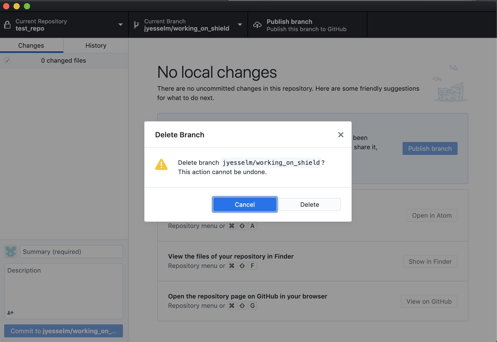

