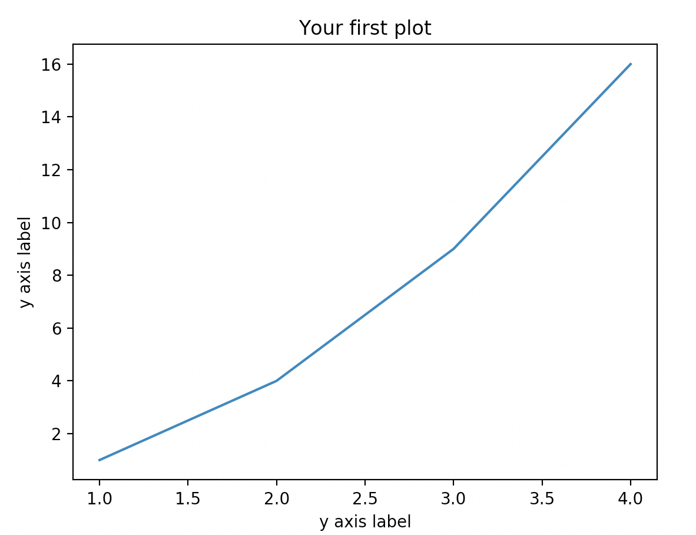
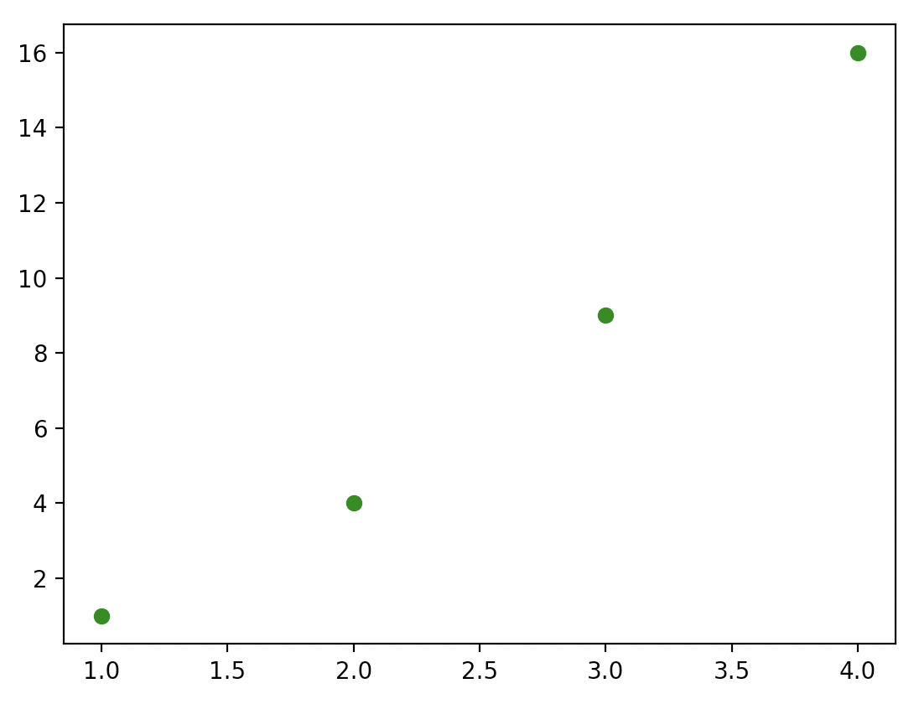
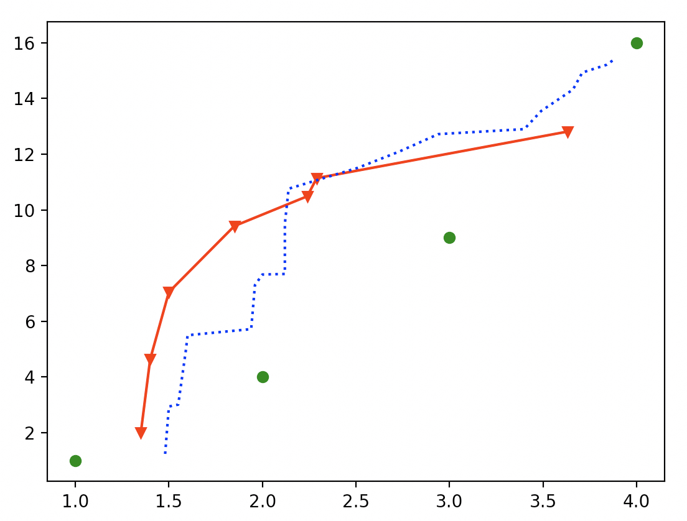
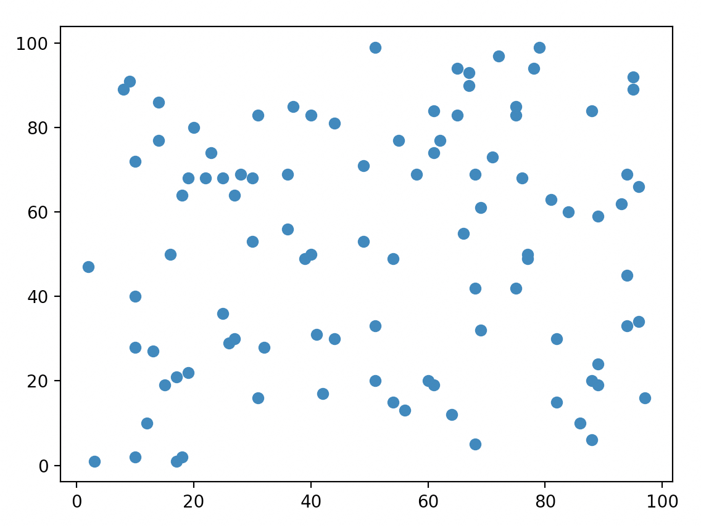
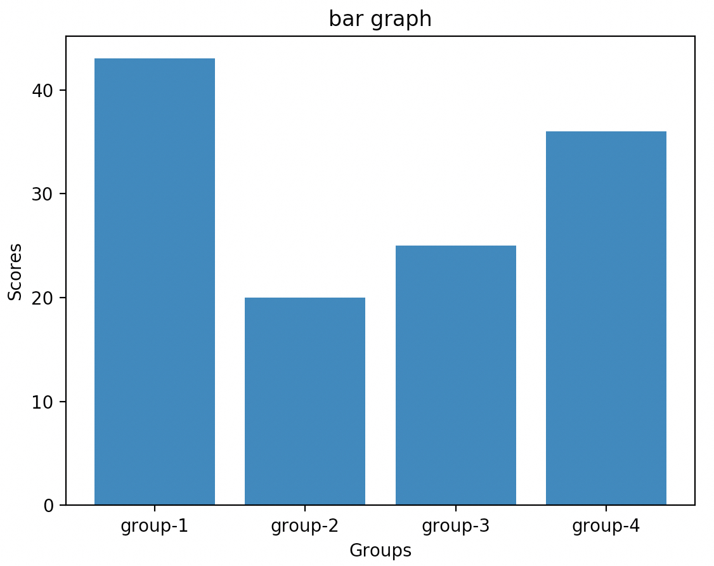
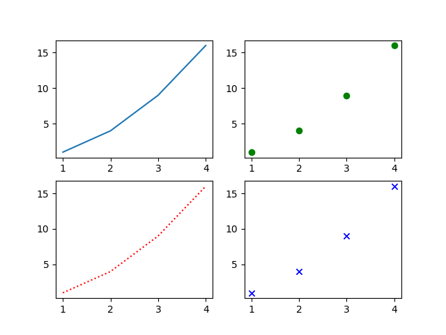

# Lecture 10: Plotting in Python: Part I, matplotlib 

Today we are going to get our first taste of plotting information in Python. This is an absolute must have skill, I still plot everything in python.

### getting the matplotlib package

With mac, linux and windows (if you installed pip): 

sudo pip installl matplotlib


If you are doing everything in pycharm get it though there:

Here is a great videos that explains how to do this: https://www.youtube.com/watch?v=PXD7faWtdAg


## Working with matplotlib 

```python
# always need to import this 
import matplotlib.pyplot as plt

# a simple line plot 
x = [1, 2, 3, 4]
y = [1, 4, 9, 16]
plt.plot(x, y)
plt.title('Your first plot')
plt.xlabel('x axis label')
plt.ylabel('y axis label')
plt.show() # creates the pop up window of the plot 

```

The plot window that pops up should look like this:




Line and point styles, here is a list of all possible styles.

https://matplotlib.org/3.1.0/api/_as_gen/matplotlib.pyplot.plot.html

It goes: 

```python
fmt = '[color][marker][line]'
```

examples:

```python
'b'    # blue markers with default shape
'or'   # red circles
'-g'   # green solid line
'--'   # dashed line with default color
'^k:'  # black triangle_up markers connected by a dotted line
```

Lets see it in action

```python
import matplotlib.pyplot as plt

# a simple line plot 
x = [1, 2, 3, 4]
y = [1, 4, 9, 16]
plt.plot(x, y, 'go') # green 'g' and 'o' marker
plt.show()
```




It is possible to keep adding new plots, each with its own styles and data.

```python
import matplotlib.pyplot as plt

x1 = [1, 2, 3, 4]
y1 = [1, 4, 9, 16]
plt.plot(x1, y1, 'go') # green 'g' and 'o' marker
x2 = [1.35, 1.4, 1.5, 1.85, 2.24, 2.29, 3.63]
y2 = [2.0, 4.64, 7.05, 9.42, 10.49, 11.14, 12.81]
plt.plot(x2, y2, 'rv-') # red 'r', 'v' marker and solid line
x3 = [1.48, 1.5, 1.55, 1.59, 1.6, 1.94, 1.96, 2.0, 2.12, 2.12, 2.14, 2.51, 2.73, 2.94, 3.4, 3.49, 3.66, 3.71, 3.84, 3.88]
y3 = [1.24, 2.94, 3.01, 4.92, 5.5, 5.72, 7.3, 7.68, 7.7, 9.5, 10.76, 11.51, 12.09, 12.72, 12.9, 13.55, 14.32, 14.93, 15.21, 15.4]
plt.plot(x3, y3, 'b:') # b 'blue', ':' dotted line

plt.show()
```




You can also save figures to file instead of showing them on screen

``` python
import matplotlib.pyplot as plt

x1 = [1, 2, 3, 4]
y1 = [1, 4, 9, 16]
plt.plot(x1, y1, 'go') # green 'g' and 'o' marker
plt.savefig("test.png") # saves plot to path "test.png"
```


## Other styles of plots 

### Scatter

```python
import matplotlib.pyplot as plt

x = [3.0, 54.0, 13.0, 61.0, 62.0, 17.0, 88.0, 96.0, 9.0, 8.0, 28.0, 23.0, 96.0, 82.0, 94.0, 39.0, 55.0, 51.0, 16.0, 68.0, 75.0, 77.0, 27.0, 10.0, 19.0, 10.0, 15.0, 27.0, 56.0, 61.0, 89.0, 60.0, 77.0, 61.0, 89.0, 17.0, 93.0, 40.0, 69.0, 10.0, 49.0, 42.0, 41.0, 12.0, 94.0, 94.0, 30.0, 72.0, 67.0, 89.0, 86.0, 10.0, 68.0, 58.0, 25.0, 40.0, 81.0, 2.0, 69.0, 20.0, 95.0, 30.0, 76.0, 31.0, 65.0, 32.0, 67.0, 68.0, 51.0, 36.0, 84.0, 88.0, 88.0, 65.0, 25.0, 37.0, 71.0, 49.0, 75.0, 18.0, 64.0, 75.0, 19.0, 31.0, 66.0, 82.0, 44.0, 14.0, 79.0, 26.0, 95.0, 78.0, 14.0, 54.0, 18.0, 97.0, 51.0, 36.0, 44.0, 22.0]

y = [1.0, 15.0, 27.0, 19.0, 77.0, 21.0, 6.0, 34.0, 91.0, 89.0, 69.0, 74.0, 66.0, 15.0, 33.0, 49.0, 77.0, 33.0, 50.0, 5.0, 42.0, 49.0, 30.0, 2.0, 68.0, 72.0, 19.0, 64.0, 13.0, 84.0, 19.0, 20.0, 50.0, 74.0, 59.0, 1.0, 62.0, 50.0, 61.0, 40.0, 71.0, 17.0, 31.0, 10.0, 45.0, 69.0, 53.0, 97.0, 90.0, 24.0, 10.0, 28.0, 69.0, 69.0, 68.0, 83.0, 63.0, 47.0, 32.0, 80.0, 92.0, 68.0, 68.0, 83.0, 83.0, 28.0, 93.0, 42.0, 20.0, 56.0, 60.0, 20.0, 84.0, 94.0, 36.0, 85.0, 73.0, 53.0, 85.0, 2.0, 12.0, 83.0, 22.0, 16.0, 55.0, 30.0, 30.0, 86.0, 99.0, 29.0, 89.0, 94.0, 77.0, 49.0, 64.0, 16.0, 99.0, 69.0, 81.0, 68.0]

plt.scatter(x, y) # creates a scatter plot 
plt.show()
```



### Barplot

```python
groups = ["group-1", "group-2", "group-3", "group-4"]
group_scores = [43, 20, 25, 36]

plt.bar(groups, group_scores)
plt.title("bar graph")
plt.xlabel("Groups")
plt.ylabel("Scores")
plt.show()
```




## Working with figures and axes

The examples I have shown you so far deal with only a single and default figure, this is fine for simple programs but if you want to have multiple figures open or make complex figures with multiple distinct plots we need to use the figure and axis objects

```python
import matplotlib.pyplot as plt

fig = plt.figure() # make a new figure
ax = fig.subplots() # make an set o faxes that takes up the entire figure

x1 = [1, 2, 3, 4]
y1 = [1, 4, 9, 16]
ax.plot(x1, y1) # plot data on that axis 

fig.savefig("test.png") # save figure
```


This generalization allows us to make multiple figures at the same time


```python
import matplotlib.pyplot as plt

fig_1 = plt.figure()
ax_1 = fig_1.subplots()

fig_2 = plt.figure()
ax_2 = fig_2.subplots()

x1 = [1, 2, 3, 4]
y1 = [1, 4, 9, 16]
ax_1.plot(x1, y1)
ax_2.plot(x1, y1, 'go') # plot the same data with a different style on another figure


fig_1.savefig("test.png") # save figure 1
fig_2.savefig("test_1.png") # save figure 2
```


We can also make figures with more than one plots on them

```python
import matplotlib.pyplot as plt

fig = plt.figure()
axes = fig.subplots(2,2) # made a 2x2 grid of plots

x1 = [1, 2, 3, 4]
y1 = [1, 4, 9, 16]

axes[0,0].plot(x1, y1) # (top, left)
axes[0,1].plot(x1, y1, 'go') # (top, right) green and 'o' marker'
axes[1,1].plot(x1, y1, 'bx') # (bottom, right) blue and 'x' marker'
axes[1,0].plot(x1, y1, 'r:') # (bottom, left) red and no marker but dashed line

fig.savefig("test.png")
```



