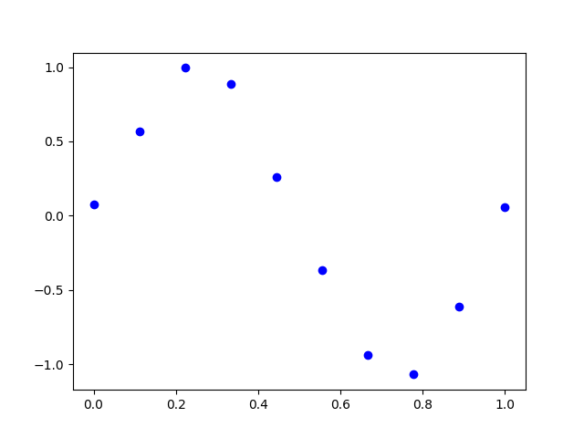
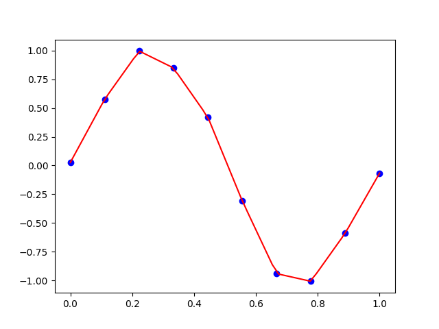
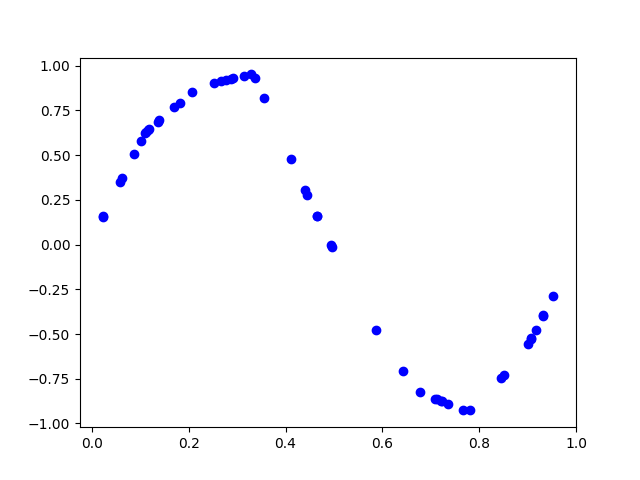
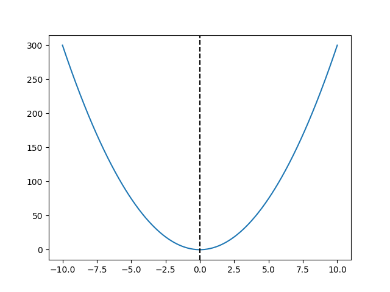
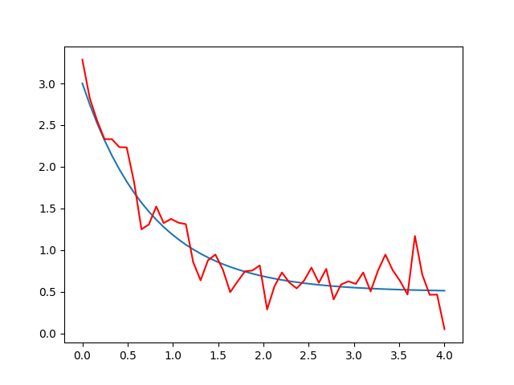
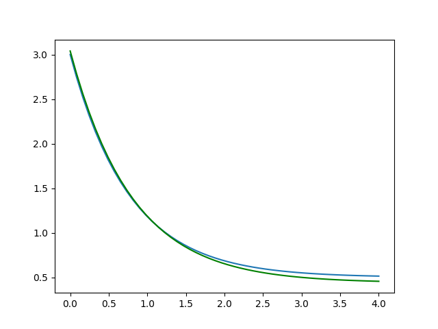
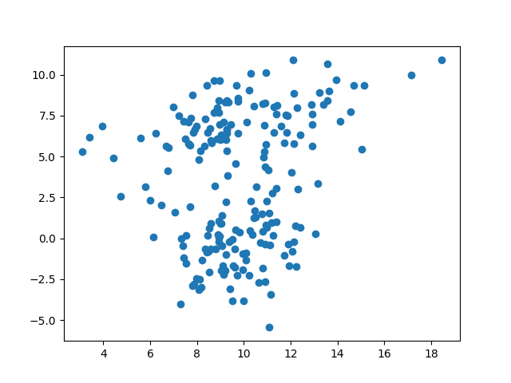
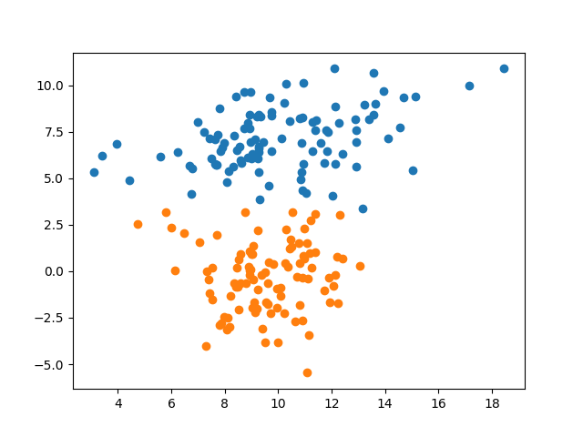

# Scipy: or Scientific Python

Scipy is a collection of modules to solve mathematical problems related to science. Scipy has quite a few sub packages listed below:

- File input / output - [**scipy.io**](https://docs.scipy.org/doc/scipy/reference/io.html)
  - For handling the loading and saving of matrixes. We will not be using this. 
- Special Function - [**scipy.special**](https://docs.scipy.org/doc/scipy/reference/special.html)
  - A collection of useful mathmatical functions such as:
    - Bessel Functions
    - Distribution functions such as binomial and gamma
    - Combinations and Permutations 
    - and many many more
- Linear Algebra Operations - [**scipy.linalg**](https://docs.scipy.org/doc/scipy/reference/linalg.html)
  - Solving linear alegbra equations 
  - Determining eigen values
  - Matrix decompositions 
- Interpolation - [**scipy.interpolate**](https://docs.scipy.org/doc/scipy/reference/interpolate.html)
  - Generating function fits to data both linear and nonlinear
- Optimization and fit - [**scipy.optimize**](https://docs.scipy.org/doc/scipy/reference/optimize.html)
  - Optimization provides a useful algorithm for minimization of curve fitting, multidimensional or scalar and root fitting.
- Statistics and random numbers - [**scipy.stats**](https://docs.scipy.org/doc/scipy/reference/stats.html)
  - r correlations and other statistical methods
- Numerical Integration - [**scipy.integrate**](https://docs.scipy.org/doc/scipy/reference/integrate.html)
  - library has single integration, double, triple, multiple, Gaussian quadrate, Romberg, Trapezoidal and Simpson's rules.
- Fast Fourier transforms - [**scipy.fftpack**](https://docs.scipy.org/doc/scipy/reference/fftpack.html)
  - Fourier transforms, don't worry we are not going to do this

- Signal Processing - [**scipy.signal**](https://docs.scipy.org/doc/scipy/reference/signal.html)
  - singal processing we are not going to be covering this
- Image manipulation – [**scipy.ndimage**](https://docs.scipy.org/doc/scipy/reference/ndimage.html)
  - simple image processing are going to be using skimage instead  


## Getting Scipy

Like matplotlib and numpy you need to install this module follow the same instructions for matplotlib.


## Linear Algebra 

Solving linear equations 

```python
import numpy as np
from scipy import linalg

# solve 
# 1x + 5y = 6
# 3x + 7y = 9
equation = np.array([[1, 5], [3, 7]])
solution = np.array([[6], [9]])

# what is the value for x and y that satifies these equations
roots = linalg.solve(equation, solution)
print(roots)
#output 
#[[0.375]
# [1.125]]

# if we take our x and y values we should get our solution values
print(equation.dot(roots))
#output
#[[6.]
# [9.]]

```

Matrix functions

```python
import numpy as np
from scipy import linalg

m = np.array([[1,2],[3,4]])

#compute the inverse of a matrix
print(linalg.inv(m))
#output 
#[[-2.   1. ]
# [ 1.5 -0.5]]

#compute the determinant of a matrix
print(linalg.det(m))
#output
#-2.0

```


## Interpolation

Interpolations use a series of functions to build a functional model that fits the supplied data. It is only predictive within the data range. 

```python
import numpy as np
import matplotlib.pyplot as plt
from scipy.interpolate import interp1d

measured_time = np.linspace(0, 1, 10) # generate 10 equal points between 0 and 1
noise = (np.random.random(10)*2 - 1) * 1e-1 # generate 10 points of noise
measures = np.sin(2 * np.pi * measured_time) + noise  # 10 points along the sin curve between 0 and 2*pi + noise

plt.plot(measured_time, measures, 'bo') # plots as blue points
plt.savefig("imgs/01.png") # save figure, see figure below
# basically its a sin curve with a little noise 
```



```python
linear_interp = interp1d(measured_time, measures) # creates a linear appromation of the data
interpolation_time = np.linspace(0, 1, 50) # 50 equally spaced points between 0 and 1
linear_results = linear_interp(interpolation_time) # call the function on all 50 points
print(linear_results)
#output
#[ 0.06184877  0.170377    0.27890523  0.38743347  0.4959617   0.60448993
#  0.67696301  0.72059196  0.76422091  0.80784986  0.85147881  0.89168972
#  0.90455638  0.91742304  0.93028969  0.94315635  0.956023    0.87750484
#  0.75329426  0.62908369  0.50487311  0.38066254  0.25960911  0.14960571
#  0.03960231 -0.0704011  -0.1804045  -0.2904079  -0.4053052  -0.52160074
# -0.63789629 -0.75419184 -0.87048739 -0.94625897 -0.9409826  -0.93570624
# -0.93042988 -0.92515352 -0.91987716 -0.86250836 -0.798628   -0.73474764
# -0.67086728 -0.60698692 -0.52239017 -0.41189793 -0.30140569 -0.19091345
# -0.08042122  0.03007102]

plt.plot(measured_time, measures, 'bo')
plt.plot(interpolation_time, linear_results, 'r') # plot linear interpolation of data 
plt.savefig("imgs/02.png")
```



```python
# random sampling from interpolation function
rand_points = np.random.sample(50) # sample 50 points from 0 to 1 
rand_interpolation = linear_interp(rand_points) # generate interpolated value for each point

plt.plot(rand_points, rand_interpolation, 'bo')
plt.savefig("imgs/03.png")

```



## Optimize 

Finding the minimal point in a function

```python
import numpy as np
from scipy import optimize 
import matplotlib.pyplot as plt

def f(x):
    return 3*x**2

x = np.linspace(-10, 10, 500)
y = f(x)
minimize_result = optimize.minimize_scalar(f)

#output
#     fun: 0.0
#    nfev: 8
#     nit: 4
# success: True
#       x: 0.0

plt.plot(x, y) # plot f(x) from -10 to 10 with 500 points
plt.axvline(minimize_result['x'], linestyle='--', color='k') # plot a line where the minimal x value is
plt.savefig("imgs/04.png")
```



Fitting a function to data

```python
import numpy as np
from scipy import optimize 
import matplotlib.pyplot as plt

def func(x, a, b, c):
  return a * np.exp(-b * x) + c

x = np.linspace(0, 4, 50)
y_org = func(x, 2.5, 1.3, 0.5) # actual answer 
y_noise = 0.2 * np.random.normal(size=len(x)) # added noise 
y = y_org + y_noise

plt.plot(x, y_org) # original data in blue
plt.plot(x, y, 'r') # noisy data in red
plt.savefig("imgs/05.png")

```



```python
popt, pcov = optimize.curve_fit(func, x, y) # fit data to get values for a, b and c 
print(popt) 
#output
# [2.60241332 1.24713444 0.43788619]

plt.plot(x, y_org) # original data
plt.plot(x, func(x, popt[0], popt[1], popt[2]), 'g') # fitted function to the noisy data
plt.savefig("imgs/06.png")
```



## Clustering 

A brief demonstration on how to assign data to clusters based on their neighbors 

```python
import numpy as np
import matplotlib.pyplot as plt
from scipy import cluster

# create a random set of points with center x=10, y=0 which vary with a variance of 3 to 1 
# in x and 1 to 4 in y
a = np.random.multivariate_normal([10, 0], [[3, 1], [1, 4]], size=[100]) 
b = np.random.multivariate_normal([10, 7], [[6, 1], [6, 4]], size=[100])

# concat the data together into a single array
data = np.concatenate((a, b))

plt.scatter(data[:, 0], data[:, 1])
plt.savefig("imgs/07.png")

```




```python
# get cluster centroids (or centers of clusters)
centroids,output = cluster.vq.kmeans(data,2) # create two cluster centroids

plt.scatter(data[:, 0], data[:, 1])
plt.scatter(centroids[:, 0], centroids[:, 1], c='r', s=100) # have the centers show as big red circles 
plt.savefig("imgs/08.png")

```


```python
#lastly assign each point to either cluster 1 or 2 
clx,output = cluster.vq.vq(data,centroids) # clx is cluster indentity of each point
print(clx)
# 0 is the first cluster, and 1 is the second cluster
#output 
#[1 1 1 1 1 1 1 1 1 1 1 1 1 1 1 1 1 1 1 1 1 1 1 1 1 1 1 1 1 1 1 1 1 1 1 1 1
# 1 1 1 1 1 1 1 1 1 1 1 1 1 1 1 1 1 1 1 1 1 1 1 1 1 1 1 1 1 1 1 1 1 0 1 1 1
# 0 1 1 1 0 1 1 1 1 1 1 1 1 1 1 1 1 1 1 1 1 1 1 1 1 1 0 0 0 0 0 0 0 0 0 0 0
# 0 0 0 0 0 0 0 1 0 0 1 0 0 0 0 0 0 0 0 0 0 0 0 0 0 0 0 0 0 0 0 0 0 0 0 0 0
# 0 0 0 0 0 0 0 0 0 0 0 0 0 0 0 0 0 0 1 0 0 0 0 0 0 0 0 0 0 0 0 0 0 0 0 0 0
# 0 0 0 0 0 0 0 0 0 0 0 0 0 0 0]

cluster_1 = []
cluster_2 = []

i = 0
for a in clx:
    if a == 0:
        cluster_1.append(data[i])
    else:
        cluster_2.append(data[i])
    i += 1

cluster_1 = np.array(cluster_1)
cluster_2 = np.array(cluster_2)

plt.scatter(cluster_1[:, 0], cluster_1[:, 1]) # cluster 1 in blue
plt.scatter(cluster_2[:, 0], cluster_2[:, 1]) # cluster 2 in orange 
plt.savefig("imgs/09.png")
```




