## Seaborn: better and prettier plots  

Seaborn is a relatively new plotting tool and it hasnt gained as wide use as the others I have showed. But based on my own use its extremely power and makes beautiful plots. 


### Relational plots

```python 
# always import all these now
import numpy as np 	
import pandas as pd 
import seaborn as sns
import matplotlib.pyplot as plt 

# grabs a pandas dataset from the seaborn test sets 
tips = sns.load_dataset("tips")

print(tips)
#output
  total_bill   tip     sex smoker   day    time  size
0         16.99  1.01  Female     No   Sun  Dinner     2
1         10.34  1.66    Male     No   Sun  Dinner     3
2         21.01  3.50    Male     No   Sun  Dinner     3
3         23.68  3.31    Male     No   Sun  Dinner     2
#... continues until 244

# scatter plot between total_bill column and tip column
# only need to supply the column names and supply the dataframe with data
sns.relplot(x="total_bill", y="tip", data=tips)
plt.savefig("imgs/01.png") # still need matplotlib to save figures 

```

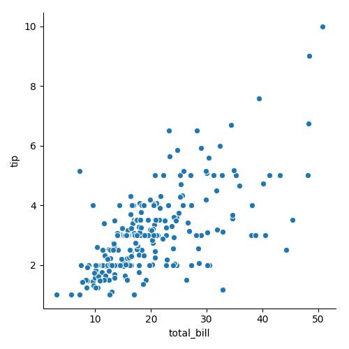

```python
# can also change other properites of the plot easily
# now changing the color of points based on whether they are a smoker or not
sns.relplot(x="total_bill", y="tip", hue="smoker", data=tips)
plt.savefig("imgs/02.png")

```

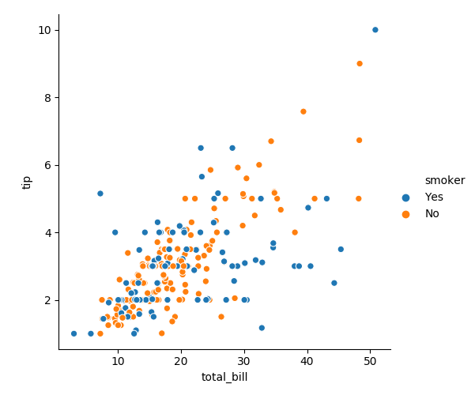

```python
# we can additionally change the marker types based on when they had their meal 
sns.relplot(x="total_bill", y="tip", hue="smoker", style="time", data=tips)
plt.savefig("imgs/03.png")
```

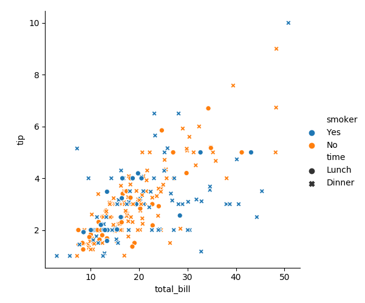

```python
# lastly we can change the size of the markers 
sns.relplot(x="total_bill", y="tip", size="size", sizes=(15, 200), data=tips)
plt.savefig("imgs/04.png")
```

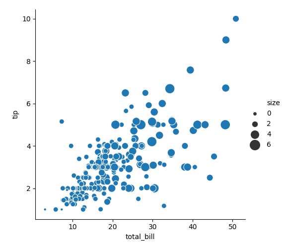

```python
#We can also create multiple plots at once each with their own categories 
sns.relplot(x="total_bill", y="tip", hue="smoker",col="time", data=tips)
plt.savefig("imgs/05.png")
```

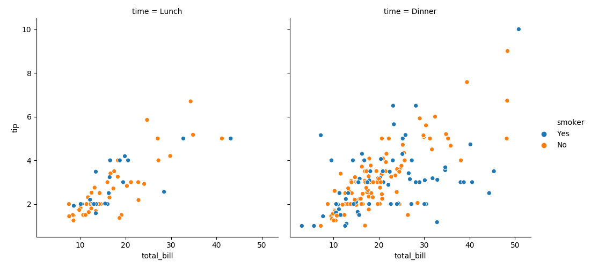

```python
# another example with more categories 
sns.relplot(x="total_bill", y="tip", hue="smoker",col="size",col_wrap=2, data=tips)
plt.savefig("imgs/06.png")
```

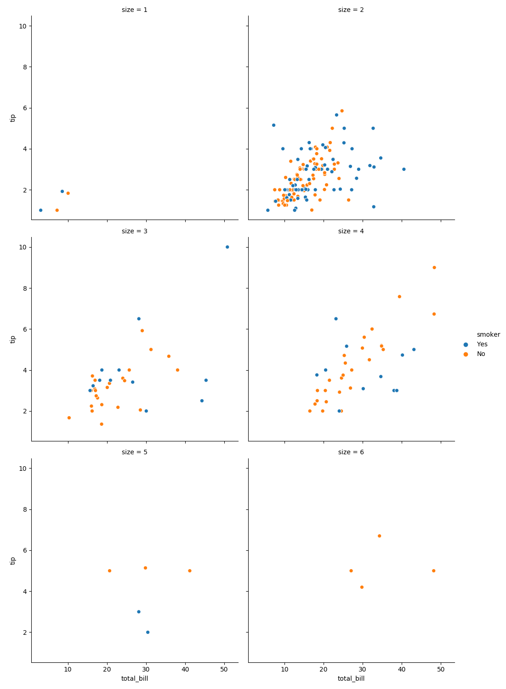

### Categorical plots


```python
sns.catplot(x="day", y="total_bill", data=tips)
plt.savefig("imgs/07.png")
```

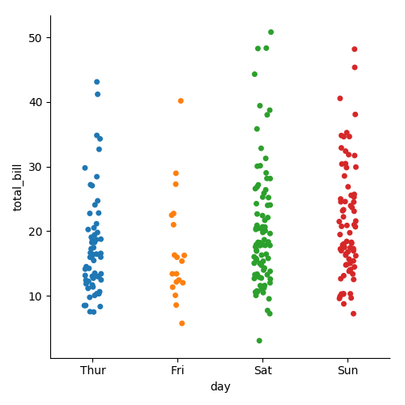

```python
sns.catplot(x="smoker", y="tip", order=["No", "Yes"], data=tips)
plt.savefig("imgs/08.png")
```

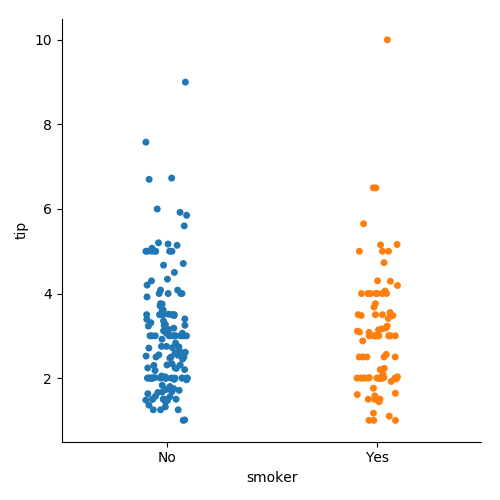

```python
sns.catplot(x="total_bill", y="day", hue="time", kind="swarm", data=tips)
plt.savefig("imgs/09.png")
```

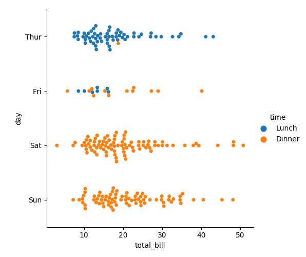

```python
sns.catplot(x="day", y="total_bill", kind="box", data=tips)
plt.savefig("imgs/10.png")
```

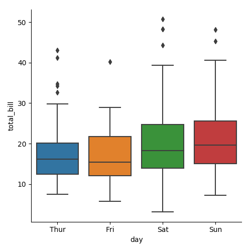

```python
sns.catplot(x="day", y="total_bill", hue="smoker", kind="box", data=tips);
plt.savefig("imgs/11.png")
```

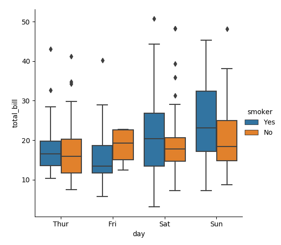

```python
sns.catplot(x="total_bill", y="day", hue="time",
            kind="violin", data=tips)
plt.savefig("imgs/12.png")
```

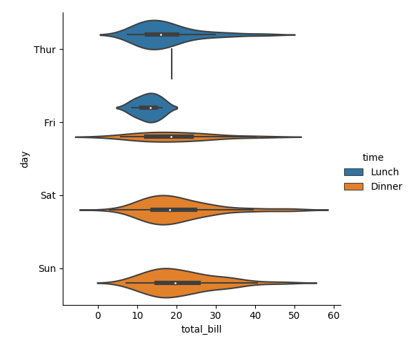

```python
sns.catplot(x="day", y="total_bill", hue="sex",
            kind="violin", split=True, data=tips)
plt.savefig("imgs/13.png")
```

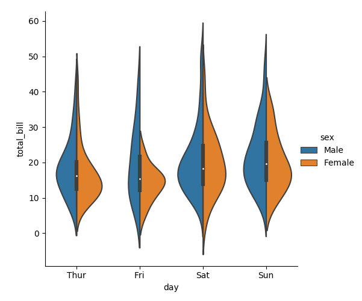

```python
sns.catplot(x="day", y="total_bill", hue="smoker",
            col="time", kind="swarm", data=tips)
plt.savefig("imgs/14.png")
```

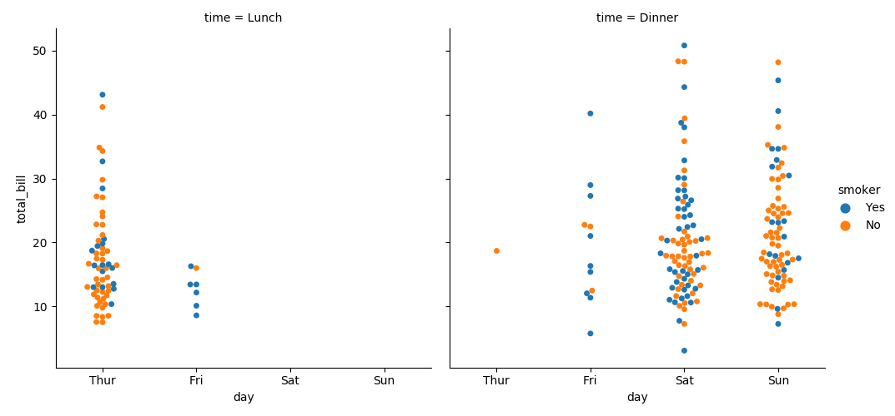

	### Distribution plots

```python
sns.distplot(tips["tip"])
plt.savefig("imgs/15.png")
```

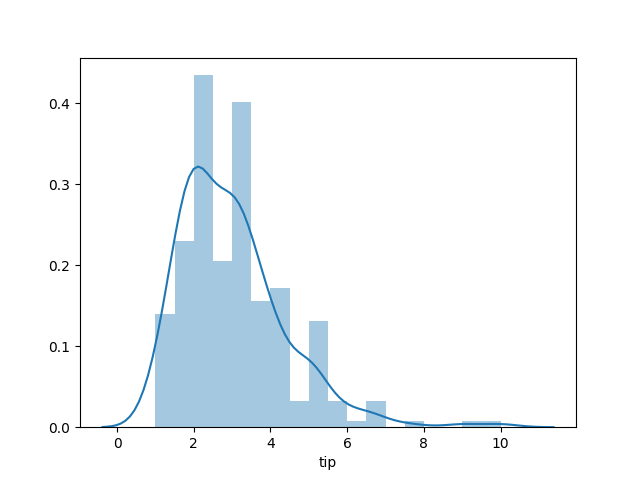

```python
sns.pairplot(tips)
plt.savefig("imgs/16.png")
```

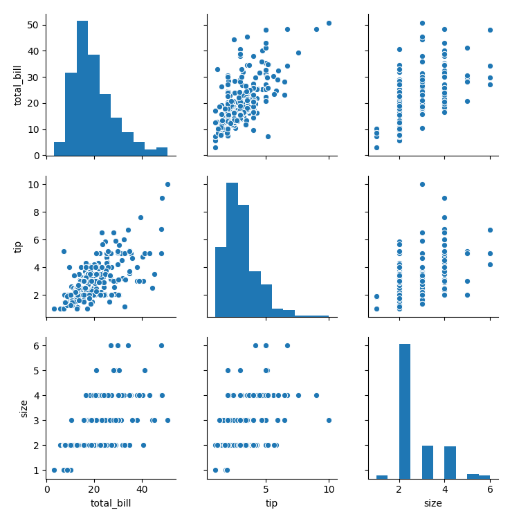

```python
sns.pairplot(tips, hue="smoker")
plt.savefig("imgs/17.png")
```

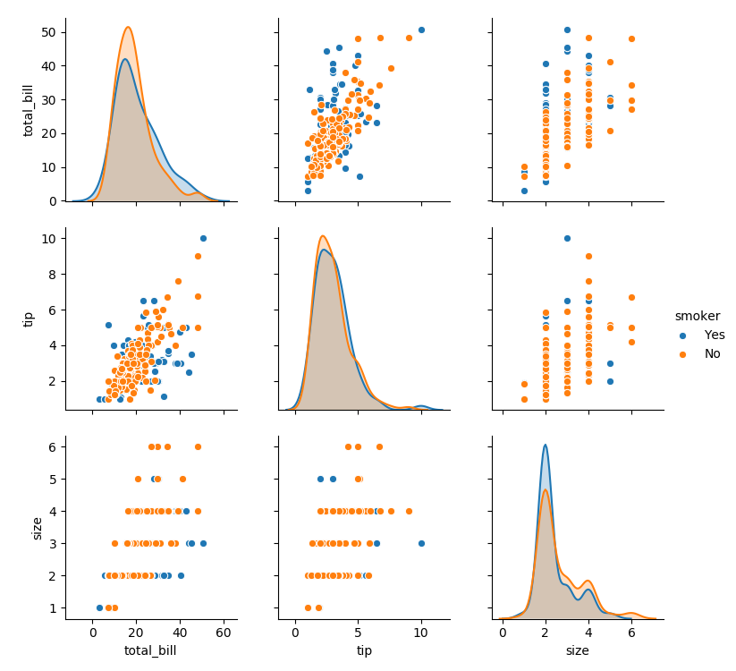

```python
sns.pairplot(tips, hue="day", vars=["total_bill", "size"])
plt.savefig("imgs/18.png")
```

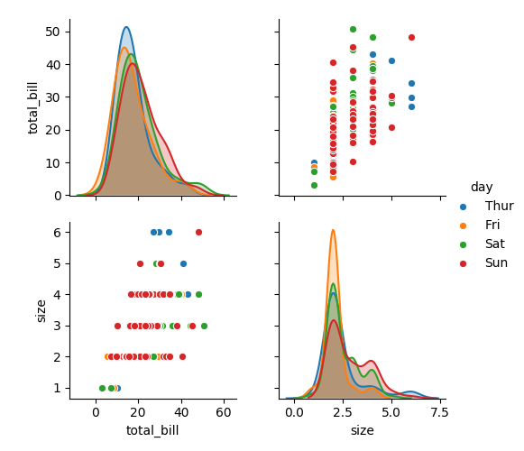