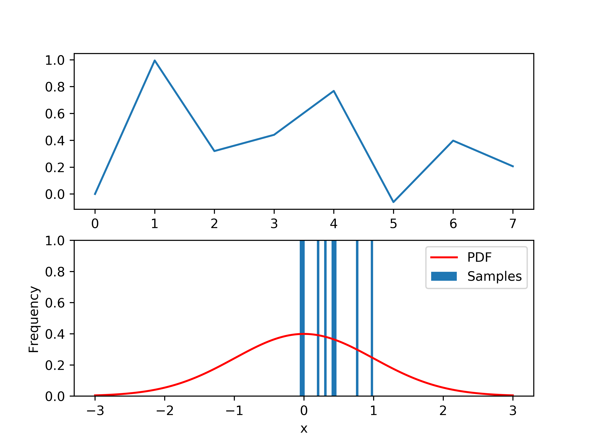
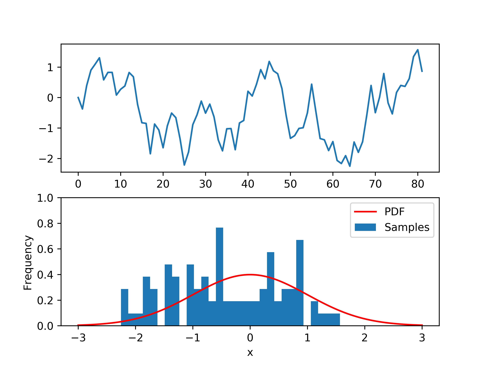
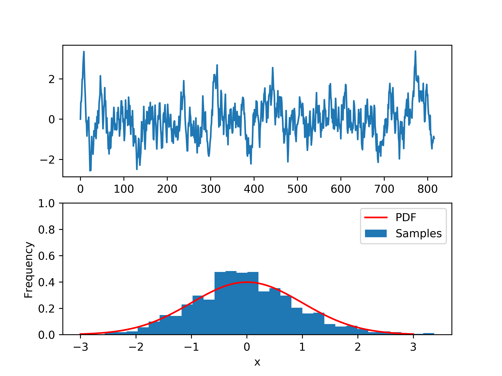
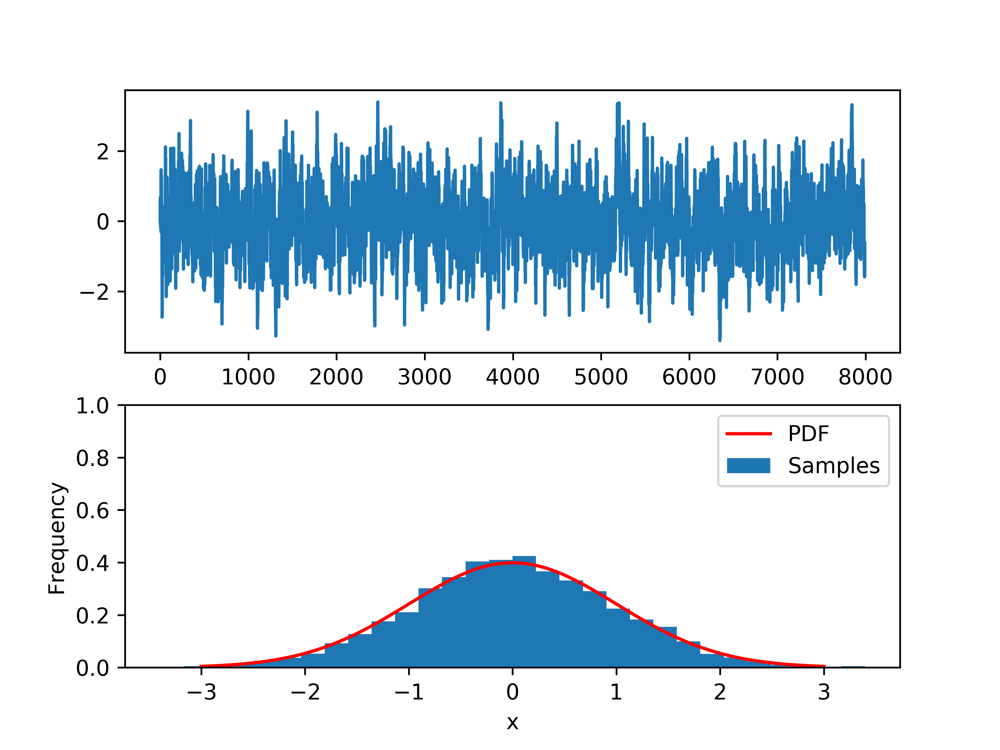
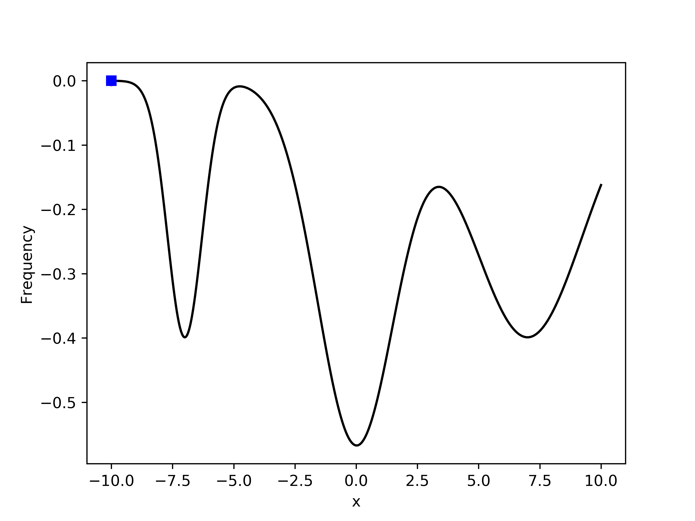
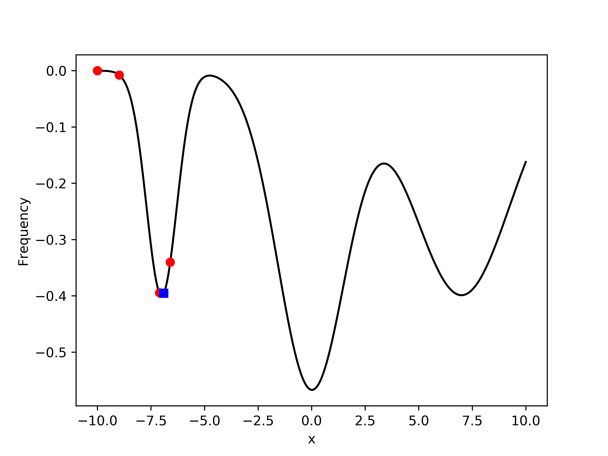
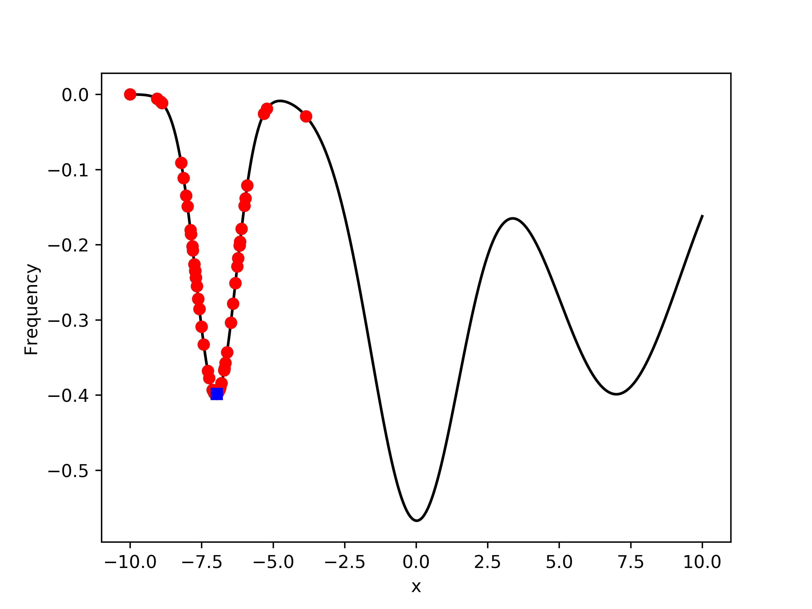
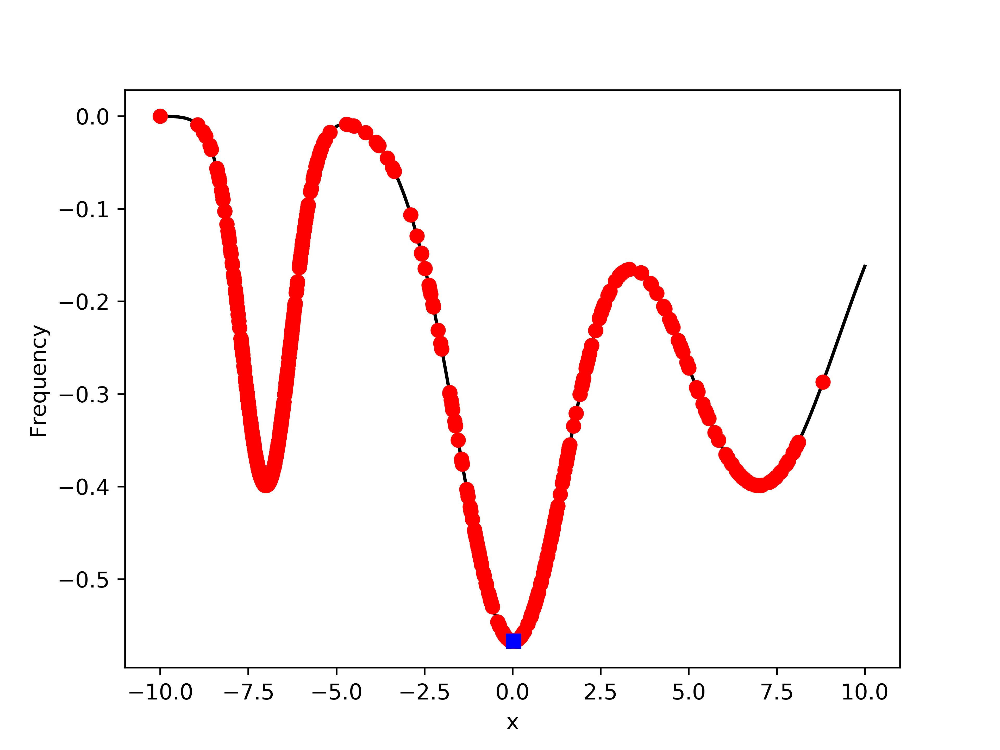

# Monte Carlo part 2

Other types of uses for Monte Carlo 

### Markov chain Monte Carlo 

https://en.wikipedia.org/wiki/Markov_chain_Monte_Carlo

 **Markov chain Monte Carlo** (**MCMC**) methods comprise a class of algorithms for sampling from a probability distribution. By constructing a markov chain that has the desired distribution as its equilabrium distribution, one can obtain a sample of the desired distribution by recording states from the chain. 

```python
def markov_chain_sampling(start_x, step_size, n_steps, func):
    current = start_x
    vec = []
    vec.append(current)
    # random moves, uniform proposal distribution
    innov = np.random.uniform(-step_size, step_size, n_steps)
    for i in range(1,n_steps):
        next = current + innov[i] #candidate
        current_y = func(current)
        next_y = func(next)
        # always accept if moving to a more favorable position
        if next_y > current_y:
            acceptance_prob = 1
        # if we are going in the wrong direction take the ratio
        else:
            acceptance_prob = next_y / current_y
        dice_roll = np.random.uniform(0, 1)
        # accept the move
        if dice_roll < acceptance_prob:
            current = next
            vec.append(current)
    return vec
```


Here is it with 10 points sampling a gaussian. With the top plot is the value of simulation at each step and the bottom is a histogram of all the points.



As we add more points the distribution fills in, here is it at 100



1000 points



10,000 points



### Monte Carlo Minimization

Is a variant on MCMC but only seeks to find the lowest point, this is quite useful if you have a complex set of data with multiple local minimal. 

```python
def minimization(start_x, step_size, n_steps, func):
    minimum = 1000
    min_x = 100
    current = start_x
    vec1 = []
    vec2 = []
    # random moves, uniform proposal distribution
    innov = np.random.uniform(-step_size, step_size, n_steps)
    for i in range(1, n_steps):
        next = current + innov[i]  # candidate
        current_y = func(current)
        next_y = func(next)
        vec1.append(current)
        vec2.append(current_y)
        # always accept if moving to a more favorable position
        if next_y < current_y:
            acceptance_prob = 1
        # if we are going in the wrong direction take the ratio
        else:
            acceptance_prob = abs(next_y / current_y)
        dice_roll = np.random.uniform(0, 1)
        # accept the move
        if dice_roll < acceptance_prob:
            current = next
        if minimum > next_y:
            minimum = next_y
            min_x = current
    return minimum, min_x, vec1, vec2
```


Here we are dealing with a complex function that could easily trap a steepest decent aglorithm into a local minimal. We are starting at point x=-10, blue square is the lowest point and red dots are sampled points.



After 10 steps we have found the local minimal 



After 100 steps we are still stuck in the local minimal but are starting to sample points outside



1000 steps is more than enough to find the absolute minimal



