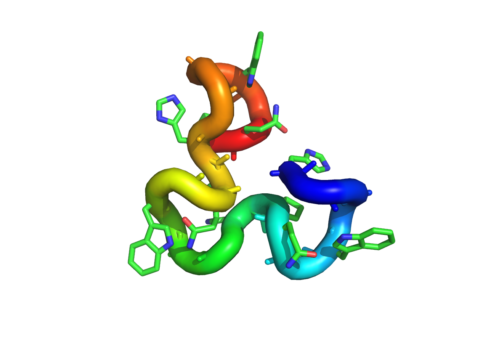
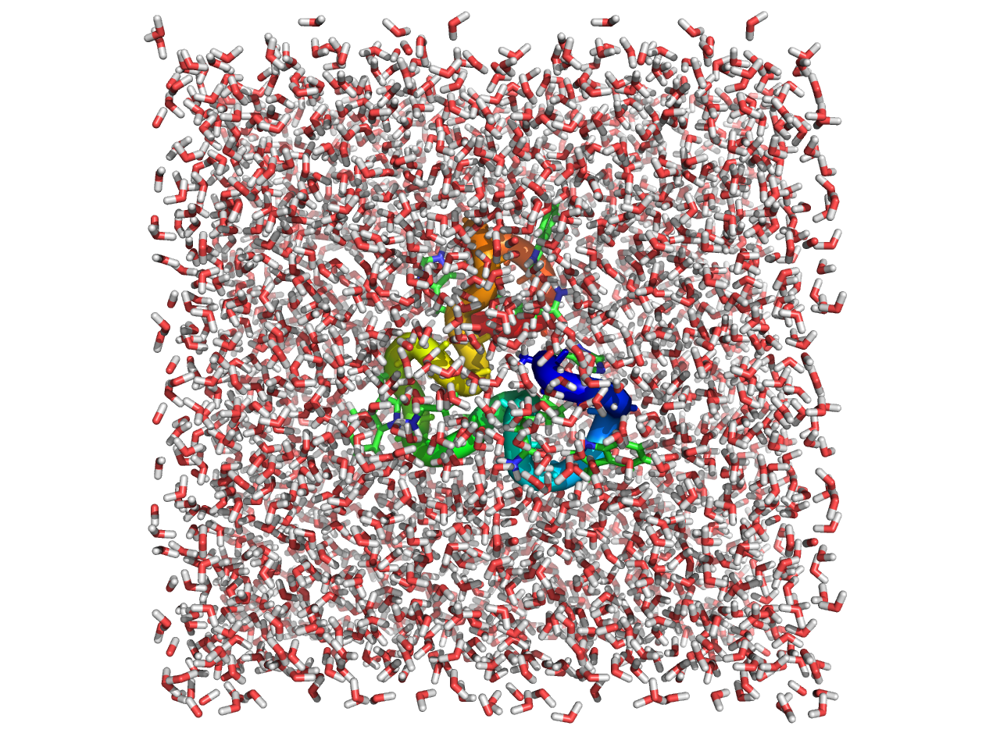

## Molecular Dynamics 


```shell
vi ~/.bashrc 

# add these 3 lines
module load compiler/gcc/4.9
module load openmpi/2.0
module load gromacs/5.1
```

Going to be working with PDB: 1OEI.pdb (Human prion protein 61-84)



This gromacs tutorial was adapted from: http://www.bevanlab.biochem.vt.edu/Pages/Personal/justin/gmx-tutorials/lysozyme/01_pdb2gmx.html

### Setting up the topology 

Now that the crystal waters are gone and we have verified that all the necessary atoms are present, the PDB file should contain only protein atoms, and is ready to be input into the first GROMACS module, pdb2gmx. The purpose of pdb2gmx is to generate three files:

1. The topology for the molecule.
2. A position restraint file.
3. A post-processed structure file.

The topology (topol.top by default) contains all the information necessary to define the molecule within a simulation. This information includes nonbonded parameters (atom types and charges) as well as bonded parameters (bonds, angles, and dihedrals). We will take a more detailed look at the topology once it has been generated.


```shell

$ gmx pdb2gmx -f 1OEI.pdb -o 1oEI_processed.gro -water spce -ignh 

                  :-) GROMACS - gmx pdb2gmx, VERSION 5.1.4 (-:

                            GROMACS is written by:
     Emile Apol      Rossen Apostolov  Herman J.C. Berendsen    Par Bjelkmar   
 Aldert van Buuren   Rudi van Drunen     Anton Feenstra   Sebastian Fritsch 
  Gerrit Groenhof   Christoph Junghans   Anca Hamuraru    Vincent Hindriksen
 Dimitrios Karkoulis    Peter Kasson        Jiri Kraus      Carsten Kutzner  
    Per Larsson      Justin A. Lemkul   Magnus Lundborg   Pieter Meulenhoff 
   Erik Marklund      Teemu Murtola       Szilard Pall       Sander Pronk   
   Roland Schulz     Alexey Shvetsov     Michael Shirts     Alfons Sijbers  
   Peter Tieleman    Teemu Virolainen  Christian Wennberg    Maarten Wolf   
                           and the project leaders:
        Mark Abraham, Berk Hess, Erik Lindahl, and David van der Spoel

Copyright (c) 1991-2000, University of Groningen, The Netherlands.
Copyright (c) 2001-2015, The GROMACS development team at
Uppsala University, Stockholm University and
the Royal Institute of Technology, Sweden.
check out http://www.gromacs.org for more information.

GROMACS is free software; you can redistribute it and/or modify it
under the terms of the GNU Lesser General Public License
as published by the Free Software Foundation; either version 2.1
of the License, or (at your option) any later version.

GROMACS:      gmx pdb2gmx, VERSION 5.1.4
Executable:   /util/opt/BCRF/GROMACS/5.1/gcc/4.9/bin/gmx_mpi
Data prefix:  /util/opt/BCRF/GROMACS/5.1/gcc/4.9
Command line:
  gmx pdb2gmx -f 1OEI.pdb -o 1oEI_processed.gro -water spce


Select the Force Field:
From '/util/opt/BCRF/GROMACS/5.1/gcc/4.9/share/gromacs/top':
 1: AMBER03 protein, nucleic AMBER94 (Duan et al., J. Comp. Chem. 24, 1999-2012, 2003)
 2: AMBER94 force field (Cornell et al., JACS 117, 5179-5197, 1995)
 3: AMBER96 protein, nucleic AMBER94 (Kollman et al., Acc. Chem. Res. 29, 461-469, 1996)
 4: AMBER99 protein, nucleic AMBER94 (Wang et al., J. Comp. Chem. 21, 1049-1074, 2000)
 5: AMBER99SB protein, nucleic AMBER94 (Hornak et al., Proteins 65, 712-725, 2006)
 6: AMBER99SB-ILDN protein, nucleic AMBER94 (Lindorff-Larsen et al., Proteins 78, 1950-58, 2010)
 7: AMBERGS force field (Garcia & Sanbonmatsu, PNAS 99, 2782-2787, 2002)
 8: CHARMM27 all-atom force field (CHARM22 plus CMAP for proteins)
 9: GROMOS96 43a1 force field
10: GROMOS96 43a2 force field (improved alkane dihedrals)
11: GROMOS96 45a3 force field (Schuler JCC 2001 22 1205)
12: GROMOS96 53a5 force field (JCC 2004 vol 25 pag 1656)
13: GROMOS96 53a6 force field (JCC 2004 vol 25 pag 1656)
14: GROMOS96 54a7 force field (Eur. Biophys. J. (2011), 40,, 843-856, DOI: 10.1007/s00249-011-0700-9)
15: OPLS-AA/L all-atom force field (2001 aminoacid dihedrals)
$15

Using the Oplsaa force field in directory oplsaa.ff

Opening force field file /util/opt/BCRF/GROMACS/5.1/gcc/4.9/share/gromacs/top/oplsaa.ff/aminoacids.r2b
Reading 1OEI.pdb...
Read 'MAJOR PRION PROTEIN', 168 atoms
Analyzing pdb file
Splitting chemical chains based on TER records or chain id changing.
There are 1 chains and 0 blocks of water and 24 residues with 168 atoms

  chain  #res #atoms
  1 'A'    24    168  

All occupancies are one
Opening force field file /util/opt/BCRF/GROMACS/5.1/gcc/4.9/share/gromacs/top/oplsaa.ff/atomtypes.atp
Atomtype 814
Reading residue database... (oplsaa)
Opening force field file /util/opt/BCRF/GROMACS/5.1/gcc/4.9/share/gromacs/top/oplsaa.ff/aminoacids.rtp
Residue 51
Sorting it all out...
Opening force field file /util/opt/BCRF/GROMACS/5.1/gcc/4.9/share/gromacs/top/oplsaa.ff/aminoacids.hdb
Opening force field file /util/opt/BCRF/GROMACS/5.1/gcc/4.9/share/gromacs/top/oplsaa.ff/aminoacids.n.tdb
Opening force field file /util/opt/BCRF/GROMACS/5.1/gcc/4.9/share/gromacs/top/oplsaa.ff/aminoacids.c.tdb
Processing chain 1 'A' (168 atoms, 24 residues)
Analysing hydrogen-bonding network for automated assignment of histidine
 protonation. 36 donors and 27 acceptors were found.
There are 39 hydrogen bonds
Will use HISD for residue 61
Will use HISE for residue 69
Will use HISE for residue 77
Identified residue HIS61 as a starting terminus.
Identified residue PRO84 as a ending terminus.
8 out of 8 lines of specbond.dat converted successfully
Special Atom Distance matrix:
                   HIS61   HIS69
                   NE210   NE266
   HIS69   NE266   1.244
   HIS77  NE2122   1.451   1.232
Start terminus HIS-61: NH3+
End terminus PRO-84: PRO-COO-
Checking for duplicate atoms....
Generating any missing hydrogen atoms and/or adding termini.
Now there are 24 residues with 303 atoms
Making bonds...
Number of bonds was 314, now 314
Generating angles, dihedrals and pairs...
Before cleaning: 779 pairs
Before cleaning: 824 dihedrals
Keeping all generated dihedrals
Making cmap torsions...
There are  824 dihedrals,   86 impropers,  555 angles
           770 pairs,      314 bonds and     0 virtual sites
Total mass 2348.447 a.m.u.
Total charge -0.226 e
Writing topology

Writing coordinate file...
                --------- PLEASE NOTE ------------
You have successfully generated a topology from: 1OEI.pdb.
The Oplsaa force field and the spce water model are used.
                --------- ETON ESAELP ------------

gcq#555: "Any one who considers arithmetical methods of producing random digits is, of course, in a state of sin." (John von Neumann)
```

This is what your directory should look like 

```shell
$ls 
1OEI.pdb  1oEI_processed.gro  posre.itp  topol.top
```


### Solvation

There are two steps to defining the box and filling it with solvent:

1. Define the box dimensions using the editconf module.
2. Fill the box with water using the solvate module (formerly called genbox).

```shell
$ gmx editconf -f 1oEI_processed.gro -o 1oEI_newbox.gro -c -d 1.0 -bt cubic

                :-) GROMACS - gmx editconf, VERSION 5.1.4 (-:

                            GROMACS is written by:
     Emile Apol      Rossen Apostolov  Herman J.C. Berendsen    Par Bjelkmar   
 Aldert van Buuren   Rudi van Drunen     Anton Feenstra   Sebastian Fritsch 
  Gerrit Groenhof   Christoph Junghans   Anca Hamuraru    Vincent Hindriksen
 Dimitrios Karkoulis    Peter Kasson        Jiri Kraus      Carsten Kutzner  
    Per Larsson      Justin A. Lemkul   Magnus Lundborg   Pieter Meulenhoff 
   Erik Marklund      Teemu Murtola       Szilard Pall       Sander Pronk   
   Roland Schulz     Alexey Shvetsov     Michael Shirts     Alfons Sijbers  
   Peter Tieleman    Teemu Virolainen  Christian Wennberg    Maarten Wolf   
                           and the project leaders:
        Mark Abraham, Berk Hess, Erik Lindahl, and David van der Spoel

Copyright (c) 1991-2000, University of Groningen, The Netherlands.
Copyright (c) 2001-2015, The GROMACS development team at
Uppsala University, Stockholm University and
the Royal Institute of Technology, Sweden.
check out http://www.gromacs.org for more information.

GROMACS is free software; you can redistribute it and/or modify it
under the terms of the GNU Lesser General Public License
as published by the Free Software Foundation; either version 2.1
of the License, or (at your option) any later version.

GROMACS:      gmx editconf, VERSION 5.1.4
Executable:   /util/opt/BCRF/GROMACS/5.1/gcc/4.9/bin/gmx_mpi
Data prefix:  /util/opt/BCRF/GROMACS/5.1/gcc/4.9
Command line:
  gmx editconf -f 1oEI_processed.gro -o 1oEI_newbox.gro -c -d 1.0 -bt cubic

Read 303 atoms
Volume: 0.001 nm^3, corresponds to roughly 0 electrons
No velocities found
    system size :  2.252  2.129  1.541 (nm)
    diameter    :  2.457               (nm)
    center      : -0.021 -0.178  3.333 (nm)
    box vectors :  0.100  0.100  0.100 (nm)
    box angles  :  90.00  90.00  90.00 (degrees)
    box volume  :   0.00               (nm^3)
    shift       :  2.249  2.407 -1.104 (nm)
new center      :  2.229  2.229  2.229 (nm)
new box vectors :  4.457  4.457  4.457 (nm)
new box angles  :  90.00  90.00  90.00 (degrees)
new box volume  :  88.56               (nm^3)

gcq#169: "We Look Pretty Sharp In These Clothes" (F. Zappa)

```


```shell
$ gmx solvate -cp 1oEI_newbox.gro -cs spc216.gro -o 1OEI_solv.gro -p topol.top

                  :-) GROMACS - gmx solvate, VERSION 5.1.4 (-:

                            GROMACS is written by:
     Emile Apol      Rossen Apostolov  Herman J.C. Berendsen    Par Bjelkmar   
 Aldert van Buuren   Rudi van Drunen     Anton Feenstra   Sebastian Fritsch 
  Gerrit Groenhof   Christoph Junghans   Anca Hamuraru    Vincent Hindriksen
 Dimitrios Karkoulis    Peter Kasson        Jiri Kraus      Carsten Kutzner  
    Per Larsson      Justin A. Lemkul   Magnus Lundborg   Pieter Meulenhoff 
   Erik Marklund      Teemu Murtola       Szilard Pall       Sander Pronk   
   Roland Schulz     Alexey Shvetsov     Michael Shirts     Alfons Sijbers  
   Peter Tieleman    Teemu Virolainen  Christian Wennberg    Maarten Wolf   
                           and the project leaders:
        Mark Abraham, Berk Hess, Erik Lindahl, and David van der Spoel

Copyright (c) 1991-2000, University of Groningen, The Netherlands.
Copyright (c) 2001-2015, The GROMACS development team at
Uppsala University, Stockholm University and
the Royal Institute of Technology, Sweden.
check out http://www.gromacs.org for more information.

GROMACS is free software; you can redistribute it and/or modify it
under the terms of the GNU Lesser General Public License
as published by the Free Software Foundation; either version 2.1
of the License, or (at your option) any later version.

GROMACS:      gmx solvate, VERSION 5.1.4
Executable:   /util/opt/BCRF/GROMACS/5.1/gcc/4.9/bin/gmx_mpi
Data prefix:  /util/opt/BCRF/GROMACS/5.1/gcc/4.9
Command line:
  gmx solvate -cp 1oEI_newbox.gro -cs spc216.gro -o 1OEI_solv.gro -p topol.top

Reading solute configuration
MAJOR PRION PROTEIN
Containing 303 atoms in 24 residues
Reading solvent configuration and velocities
216H2O,WATJP01,SPC216,SPC-MODEL,300K,BOX(M)=1.86206NM,WFVG,MAR. 1984
Containing 648 atoms in 216 residues

Initialising inter-atomic distances...

WARNING: Masses and atomic (Van der Waals) radii will be guessed
         based on residue and atom names, since they could not be
         definitively assigned from the information in your input
         files. These guessed numbers might deviate from the mass
         and radius of the atom type. Please check the output
         files if necessary.

NOTE: From version 5.0 gmx uses the Van der Waals radii
from the source below. This means the results may be different
compared to previous GROMACS versions.

++++ PLEASE READ AND CITE THE FOLLOWING REFERENCE ++++
A. Bondi
van der Waals Volumes and Radii
J. Phys. Chem. 68 (1964) pp. 441-451
-------- -------- --- Thank You --- -------- --------

Generating solvent configuration
Will generate new solvent configuration of 3x3x3 boxes
Solvent box contains 10887 atoms in 3629 residues
Removed 2178 solvent atoms due to solvent-solvent overlap
Removed 294 solvent atoms due to solute-solvent overlap
Sorting configuration
Found 1 molecule type:
    SOL (   3 atoms):  2805 residues
Generated solvent containing 8415 atoms in 2805 residues
Writing generated configuration to 1OEI_solv.gro

Output configuration contains 8718 atoms in 2829 residues
Volume                 :     88.5633 (nm^3)
Density                :     993.842 (g/l)
Number of SOL molecules:   2805   

Processing topology

Back Off! I just backed up temp.topMzGoQ7 to ./#temp.topMzGoQ7.1#
Adding line for 2805 solvent molecules to topology file (topol.top)

Back Off! I just backed up topol.top to ./#topol.top.1#

gcq#236: "Uh-oh, We're In Trouble" (Shampoo)

```

Your system should look like this now




### Minimization 

The solvated, electroneutral system is now assembled. Before we can begin dynamics, we must ensure that the system has no steric clashes or inappropriate geometry. The structure is relaxed through a process called energy minimization (EM).

```shell
$ gmx grompp -f minim.mdp -c 1OEI_solv.gro -p topol.top -o em.tpr
                  :-) GROMACS - gmx grompp, VERSION 5.1.4 (-:

                            GROMACS is written by:
     Emile Apol      Rossen Apostolov  Herman J.C. Berendsen    Par Bjelkmar   
 Aldert van Buuren   Rudi van Drunen     Anton Feenstra   Sebastian Fritsch 
  Gerrit Groenhof   Christoph Junghans   Anca Hamuraru    Vincent Hindriksen
 Dimitrios Karkoulis    Peter Kasson        Jiri Kraus      Carsten Kutzner  
    Per Larsson      Justin A. Lemkul   Magnus Lundborg   Pieter Meulenhoff 
   Erik Marklund      Teemu Murtola       Szilard Pall       Sander Pronk   
   Roland Schulz     Alexey Shvetsov     Michael Shirts     Alfons Sijbers  
   Peter Tieleman    Teemu Virolainen  Christian Wennberg    Maarten Wolf   
                           and the project leaders:
        Mark Abraham, Berk Hess, Erik Lindahl, and David van der Spoel

Copyright (c) 1991-2000, University of Groningen, The Netherlands.
Copyright (c) 2001-2015, The GROMACS development team at
Uppsala University, Stockholm University and
the Royal Institute of Technology, Sweden.
check out http://www.gromacs.org for more information.

GROMACS is free software; you can redistribute it and/or modify it
under the terms of the GNU Lesser General Public License
as published by the Free Software Foundation; either version 2.1
of the License, or (at your option) any later version.

GROMACS:      gmx grompp, VERSION 5.1.4
Executable:   /util/opt/BCRF/GROMACS/5.1/gcc/4.9/bin/gmx_mpi
Data prefix:  /util/opt/BCRF/GROMACS/5.1/gcc/4.9
Command line:
  gmx grompp -f minim.mdp -c 1OEI_solv.gro -p topol.top -o em.tpr


Back Off! I just backed up mdout.mdp to ./#mdout.mdp.6#

NOTE 1 [file minim.mdp]:
  With Verlet lists the optimal nstlist is >= 10, with GPUs >= 20. Note
  that with the Verlet scheme, nstlist has no effect on the accuracy of
  your simulation.

Setting the LD random seed to 1845630889
Generated 330891 of the 330891 non-bonded parameter combinations
Generating 1-4 interactions: fudge = 0.5
Generated 330891 of the 330891 1-4 parameter combinations
Excluding 3 bonded neighbours molecule type 'Protein_chain_A'
Excluding 2 bonded neighbours molecule type 'SOL'

NOTE 2 [file topol.top, line 2946]:
  System has non-zero total charge: -0.226000
  Total charge should normally be an integer. See
  http://www.gromacs.org/Documentation/Floating_Point_Arithmetic
  for discussion on how close it should be to an integer.
  


Removing all charge groups because cutoff-scheme=Verlet
Analysing residue names:
There are:    24    Protein residues
There are:  2805      Water residues
Analysing Protein...
Number of degrees of freedom in T-Coupling group rest is 17736.00
Calculating fourier grid dimensions for X Y Z
Using a fourier grid of 40x40x40, spacing 0.111 0.111 0.111
Estimate for the relative computational load of the PME mesh part: 0.24
This run will generate roughly 1 Mb of data

gcq#94: "Proceed, With Fingers Crossed" (TeX)
```

actually run it 

```shell
$gmx mdrun -v -deffnm em

                   :-) GROMACS - gmx mdrun, VERSION 5.1.4 (-:

                            GROMACS is written by:
     Emile Apol      Rossen Apostolov  Herman J.C. Berendsen    Par Bjelkmar   
 Aldert van Buuren   Rudi van Drunen     Anton Feenstra   Sebastian Fritsch 
  Gerrit Groenhof   Christoph Junghans   Anca Hamuraru    Vincent Hindriksen
 Dimitrios Karkoulis    Peter Kasson        Jiri Kraus      Carsten Kutzner  
    Per Larsson      Justin A. Lemkul   Magnus Lundborg   Pieter Meulenhoff 
   Erik Marklund      Teemu Murtola       Szilard Pall       Sander Pronk   
   Roland Schulz     Alexey Shvetsov     Michael Shirts     Alfons Sijbers  
   Peter Tieleman    Teemu Virolainen  Christian Wennberg    Maarten Wolf   
                           and the project leaders:
        Mark Abraham, Berk Hess, Erik Lindahl, and David van der Spoel

Copyright (c) 1991-2000, University of Groningen, The Netherlands.
Copyright (c) 2001-2015, The GROMACS development team at
Uppsala University, Stockholm University and
the Royal Institute of Technology, Sweden.
check out http://www.gromacs.org for more information.

GROMACS is free software; you can redistribute it and/or modify it
under the terms of the GNU Lesser General Public License
as published by the Free Software Foundation; either version 2.1
of the License, or (at your option) any later version.

GROMACS:      gmx mdrun, VERSION 5.1.4
Executable:   /util/opt/BCRF/GROMACS/5.1/gcc/4.9/bin/gmx_mpi
Data prefix:  /util/opt/BCRF/GROMACS/5.1/gcc/4.9
Command line:
  gmx mdrun -v -deffnm em

Running on 1 node with total 16 cores, 16 logical cores
Hardware detected on host login.crane.hcc.unl.edu (the node of MPI rank 0):
  CPU info:
    Vendor: GenuineIntel
    Brand:  Intel(R) Xeon(R) CPU E5-2670 0 @ 2.60GHz
    SIMD instructions most likely to fit this hardware: AVX_256
    SIMD instructions selected at GROMACS compile time: AVX_256

Reading file em.tpr, VERSION 5.1.4 (single precision)
Using 1 MPI process
Using 16 OpenMP threads 

Steepest Descents:
   Tolerance (Fmax)   =  1.00000e+03
   Number of steps    =        50000
Step=    0, Dmax= 1.0e-02 nm, Epot= -5.49874e+04 Fmax= 1.80557e+05, atom= 760
Step=    1, Dmax= 1.0e-02 nm, Epot= -6.89736e+04 Fmax= 5.34717e+04, atom= 760
....

```


### Equillbrium runs

Equilibration is often conducted in two phases. The first phase is conducted under an *NVT* ensemble (constant Number of particles, Volume, and Temperature). This ensemble is also referred to as "isothermal-isochoric" or "canonical." The timeframe for such a procedure is dependent upon the contents of the system, but in *NVT*, the temperature of the system should reach a plateau at the desired value. If the temperature has not yet stabilized, additional time will be required. Typically, 50-100 ps should suffice, and we will conduct a 100-ps *NVT* equilibration for this exercise.

setup first one

```shell
$ gmx grompp -f nvt.mdp -c em.gro -p topol.top -o nvt.tpr

gmx grompp -f nvt.mdp -c em.gro -p topol.top -o nvt.tpr -v 
                  :-) GROMACS - gmx grompp, VERSION 5.1.4 (-:

                            GROMACS is written by:
     Emile Apol      Rossen Apostolov  Herman J.C. Berendsen    Par Bjelkmar   
 Aldert van Buuren   Rudi van Drunen     Anton Feenstra   Sebastian Fritsch 
  Gerrit Groenhof   Christoph Junghans   Anca Hamuraru    Vincent Hindriksen
 Dimitrios Karkoulis    Peter Kasson        Jiri Kraus      Carsten Kutzner  
    Per Larsson      Justin A. Lemkul   Magnus Lundborg   Pieter Meulenhoff 
   Erik Marklund      Teemu Murtola       Szilard Pall       Sander Pronk   
   Roland Schulz     Alexey Shvetsov     Michael Shirts     Alfons Sijbers  
   Peter Tieleman    Teemu Virolainen  Christian Wennberg    Maarten Wolf   
                           and the project leaders:
        Mark Abraham, Berk Hess, Erik Lindahl, and David van der Spoel

Copyright (c) 1991-2000, University of Groningen, The Netherlands.
Copyright (c) 2001-2015, The GROMACS development team at
Uppsala University, Stockholm University and
the Royal Institute of Technology, Sweden.
check out http://www.gromacs.org for more information.

GROMACS is free software; you can redistribute it and/or modify it
under the terms of the GNU Lesser General Public License
as published by the Free Software Foundation; either version 2.1
of the License, or (at your option) any later version.

GROMACS:      gmx grompp, VERSION 5.1.4
Executable:   /util/opt/BCRF/GROMACS/5.1/gcc/4.9/bin/gmx_mpi
Data prefix:  /util/opt/BCRF/GROMACS/5.1/gcc/4.9
Command line:
  gmx grompp -f nvt.mdp -c em.gro -p topol.top -o nvt.tpr -v

Ignoring obsolete mdp entry 'title'

checking input for internal consistency...
Setting the LD random seed to 4121545800
processing topology...
Generated 330891 of the 330891 non-bonded parameter combinations
Generating 1-4 interactions: fudge = 0.5
Generated 330891 of the 330891 1-4 parameter combinations
Excluding 3 bonded neighbours molecule type 'Protein_chain_A'
turning all bonds into constraints...
Excluding 2 bonded neighbours molecule type 'SOL'
turning all bonds into constraints...

NOTE 1 [file topol.top, line 2946]:
  System has non-zero total charge: -0.226000
  Total charge should normally be an integer. See
  http://www.gromacs.org/Documentation/Floating_Point_Arithmetic
  for discussion on how close it should be to an integer.
  
processing coordinates...
double-checking input for internal consistency...
Setting gen_seed to 3866415723
Velocities were taken from a Maxwell distribution at 300 K
Removing all charge groups because cutoff-scheme=Verlet
Reading position restraint coords from em.gro
renumbering atomtypes...
converting bonded parameters...
initialising group options...
processing index file...
Analysing residue names:
There are:    24    Protein residues
There are:  2805      Water residues
Analysing Protein...
Making dummy/rest group for Acceleration containing 8718 elements
Making dummy/rest group for Freeze containing 8718 elements
Making dummy/rest group for Energy Mon. containing 8718 elements
Making dummy/rest group for VCM containing 8718 elements
Number of degrees of freedom in T-Coupling group Protein is 594.90
Number of degrees of freedom in T-Coupling group non-Protein is 16827.10
Making dummy/rest group for User1 containing 8718 elements
Making dummy/rest group for User2 containing 8718 elements
Making dummy/rest group for Compressed X containing 8718 elements
Making dummy/rest group for Or. Res. Fit containing 8718 elements
Making dummy/rest group for QMMM containing 8718 elements
T-Coupling       has 2 element(s): Protein non-Protein
Energy Mon.      has 1 element(s): rest
Acceleration     has 1 element(s): rest
Freeze           has 1 element(s): rest
User1            has 1 element(s): rest
User2            has 1 element(s): rest
VCM              has 1 element(s): rest
Compressed X     has 1 element(s): rest
Or. Res. Fit     has 1 element(s): rest
QMMM             has 1 element(s): rest
Determining Verlet buffer for a tolerance of 0.005 kJ/mol/ps at 300 K
Calculated rlist for 1x1 atom pair-list as 1.035 nm, buffer size 0.035 nm
Set rlist, assuming 4x4 atom pair-list, to 1.000 nm, buffer size 0.000 nm
Note that mdrun will redetermine rlist based on the actual pair-list setup
Checking consistency between energy and charge groups...
Calculating fourier grid dimensions for X Y Z
Using a fourier grid of 28x28x28, spacing 0.159 0.159 0.159
Estimate for the relative computational load of the PME mesh part: 0.20
This run will generate roughly 5 Mb of data
writing run input file...

gcq#278: "Just a Minute While I Reinvent Myself" (Red Hot Chili Peppers)

```

Lets now run it

```shell
gmx mdrun -deffnm nvt -v 

gmx mdrun -deffnm nvt -v 
                   :-) GROMACS - gmx mdrun, VERSION 5.1.4 (-:

                            GROMACS is written by:
     Emile Apol      Rossen Apostolov  Herman J.C. Berendsen    Par Bjelkmar   
 Aldert van Buuren   Rudi van Drunen     Anton Feenstra   Sebastian Fritsch 
  Gerrit Groenhof   Christoph Junghans   Anca Hamuraru    Vincent Hindriksen
 Dimitrios Karkoulis    Peter Kasson        Jiri Kraus      Carsten Kutzner  
    Per Larsson      Justin A. Lemkul   Magnus Lundborg   Pieter Meulenhoff 
   Erik Marklund      Teemu Murtola       Szilard Pall       Sander Pronk   
   Roland Schulz     Alexey Shvetsov     Michael Shirts     Alfons Sijbers  
   Peter Tieleman    Teemu Virolainen  Christian Wennberg    Maarten Wolf   
                           and the project leaders:
        Mark Abraham, Berk Hess, Erik Lindahl, and David van der Spoel

Copyright (c) 1991-2000, University of Groningen, The Netherlands.
Copyright (c) 2001-2015, The GROMACS development team at
Uppsala University, Stockholm University and
the Royal Institute of Technology, Sweden.
check out http://www.gromacs.org for more information.

GROMACS is free software; you can redistribute it and/or modify it
under the terms of the GNU Lesser General Public License
as published by the Free Software Foundation; either version 2.1
of the License, or (at your option) any later version.

GROMACS:      gmx mdrun, VERSION 5.1.4
Executable:   /util/opt/BCRF/GROMACS/5.1/gcc/4.9/bin/gmx_mpi
Data prefix:  /util/opt/BCRF/GROMACS/5.1/gcc/4.9
Command line:
  gmx mdrun -deffnm nvt -v


Running on 1 node with total 16 cores, 16 logical cores
Hardware detected on host login.crane.hcc.unl.edu (the node of MPI rank 0):
  CPU info:
    Vendor: GenuineIntel
    Brand:  Intel(R) Xeon(R) CPU E5-2670 0 @ 2.60GHz
    SIMD instructions most likely to fit this hardware: AVX_256
    SIMD instructions selected at GROMACS compile time: AVX_256

Reading file nvt.tpr, VERSION 5.1.4 (single precision)
Changing nstlist from 10 to 20, rlist from 1 to 1.03

Using 1 MPI process
Using 16 OpenMP threads 

starting mdrun 'MAJOR PRION PROTEIN in water'
10000 steps,     20.0 ps.
step 4100, remaining wall clock time:    25 s          
```

Setting up second run 

```shell
$ gmx grompp -f npt.mdp -c nvt.gro -t nvt.cpt -p topol.top -o npt.tpr

gmx grompp -f npt.mdp -c nvt.gro -t nvt.cpt -p topol.top -o npt.tpr
                  :-) GROMACS - gmx grompp, VERSION 5.1.4 (-:

                            GROMACS is written by:
     Emile Apol      Rossen Apostolov  Herman J.C. Berendsen    Par Bjelkmar   
 Aldert van Buuren   Rudi van Drunen     Anton Feenstra   Sebastian Fritsch 
  Gerrit Groenhof   Christoph Junghans   Anca Hamuraru    Vincent Hindriksen
 Dimitrios Karkoulis    Peter Kasson        Jiri Kraus      Carsten Kutzner  
    Per Larsson      Justin A. Lemkul   Magnus Lundborg   Pieter Meulenhoff 
   Erik Marklund      Teemu Murtola       Szilard Pall       Sander Pronk   
   Roland Schulz     Alexey Shvetsov     Michael Shirts     Alfons Sijbers  
   Peter Tieleman    Teemu Virolainen  Christian Wennberg    Maarten Wolf   
                           and the project leaders:
        Mark Abraham, Berk Hess, Erik Lindahl, and David van der Spoel

Copyright (c) 1991-2000, University of Groningen, The Netherlands.
Copyright (c) 2001-2015, The GROMACS development team at
Uppsala University, Stockholm University and
the Royal Institute of Technology, Sweden.
check out http://www.gromacs.org for more information.

GROMACS is free software; you can redistribute it and/or modify it
under the terms of the GNU Lesser General Public License
as published by the Free Software Foundation; either version 2.1
of the License, or (at your option) any later version.

GROMACS:      gmx grompp, VERSION 5.1.4
Executable:   /util/opt/BCRF/GROMACS/5.1/gcc/4.9/bin/gmx_mpi
Data prefix:  /util/opt/BCRF/GROMACS/5.1/gcc/4.9
Command line:
  gmx grompp -f npt.mdp -c nvt.gro -t nvt.cpt -p topol.top -o npt.tpr

Ignoring obsolete mdp entry 'title'

Back Off! I just backed up mdout.mdp to ./#mdout.mdp.8#
Setting the LD random seed to 4061202817
Generated 330891 of the 330891 non-bonded parameter combinations
Generating 1-4 interactions: fudge = 0.5
Generated 330891 of the 330891 1-4 parameter combinations
Excluding 3 bonded neighbours molecule type 'Protein_chain_A'
turning all bonds into constraints...
Excluding 2 bonded neighbours molecule type 'SOL'
turning all bonds into constraints...

NOTE 1 [file topol.top, line 2946]:
  System has non-zero total charge: -0.226000
  Total charge should normally be an integer. See
  http://www.gromacs.org/Documentation/Floating_Point_Arithmetic
  for discussion on how close it should be to an integer.
  


Removing all charge groups because cutoff-scheme=Verlet
The center of mass of the position restraint coord's is  2.227  2.227  2.219
The center of mass of the position restraint coord's is  2.227  2.227  2.219
Analysing residue names:
There are:    24    Protein residues
There are:  2805      Water residues
Analysing Protein...
Number of degrees of freedom in T-Coupling group Protein is 594.90
Number of degrees of freedom in T-Coupling group non-Protein is 16827.10
Determining Verlet buffer for a tolerance of 0.005 kJ/mol/ps at 300 K
Calculated rlist for 1x1 atom pair-list as 1.035 nm, buffer size 0.035 nm
Set rlist, assuming 4x4 atom pair-list, to 1.000 nm, buffer size 0.000 nm
Note that mdrun will redetermine rlist based on the actual pair-list setup
Reading Coordinates, Velocities and Box size from old trajectory
Will read whole trajectory
Last frame         -1 time   20.000   
Using frame at t = 20 ps
Starting time for run is 0 ps
Calculating fourier grid dimensions for X Y Z
Using a fourier grid of 28x28x28, spacing 0.159 0.159 0.159
Estimate for the relative computational load of the PME mesh part: 0.20
This run will generate roughly 5 Mb of data

gcq#371: "England's dancing days are done" (P. J. Harvey)
```

And run it with mdrun 

```shell
gmx mdrun -deffnm npt -v 
                   :-) GROMACS - gmx mdrun, VERSION 5.1.4 (-:

                            GROMACS is written by:
     Emile Apol      Rossen Apostolov  Herman J.C. Berendsen    Par Bjelkmar   
 Aldert van Buuren   Rudi van Drunen     Anton Feenstra   Sebastian Fritsch 
  Gerrit Groenhof   Christoph Junghans   Anca Hamuraru    Vincent Hindriksen
 Dimitrios Karkoulis    Peter Kasson        Jiri Kraus      Carsten Kutzner  
    Per Larsson      Justin A. Lemkul   Magnus Lundborg   Pieter Meulenhoff 
   Erik Marklund      Teemu Murtola       Szilard Pall       Sander Pronk   
   Roland Schulz     Alexey Shvetsov     Michael Shirts     Alfons Sijbers  
   Peter Tieleman    Teemu Virolainen  Christian Wennberg    Maarten Wolf   
                           and the project leaders:
        Mark Abraham, Berk Hess, Erik Lindahl, and David van der Spoel

Copyright (c) 1991-2000, University of Groningen, The Netherlands.
Copyright (c) 2001-2015, The GROMACS development team at
Uppsala University, Stockholm University and
the Royal Institute of Technology, Sweden.
check out http://www.gromacs.org for more information.

GROMACS is free software; you can redistribute it and/or modify it
under the terms of the GNU Lesser General Public License
as published by the Free Software Foundation; either version 2.1
of the License, or (at your option) any later version.

GROMACS:      gmx mdrun, VERSION 5.1.4
Executable:   /util/opt/BCRF/GROMACS/5.1/gcc/4.9/bin/gmx_mpi
Data prefix:  /util/opt/BCRF/GROMACS/5.1/gcc/4.9
Command line:
  gmx mdrun -deffnm npt -v


Back Off! I just backed up npt.log to ./#npt.log.3#

Running on 1 node with total 16 cores, 16 logical cores
Hardware detected on host login.crane.hcc.unl.edu (the node of MPI rank 0):
  CPU info:
    Vendor: GenuineIntel
    Brand:  Intel(R) Xeon(R) CPU E5-2670 0 @ 2.60GHz
    SIMD instructions most likely to fit this hardware: AVX_256
    SIMD instructions selected at GROMACS compile time: AVX_256

Reading file npt.tpr, VERSION 5.1.4 (single precision)
Changing nstlist from 10 to 20, rlist from 1 to 1.03

Using 1 MPI process
Using 16 OpenMP threads 


Back Off! I just backed up npt.trr to ./#npt.trr.3#

Back Off! I just backed up npt.edr to ./#npt.edr.3#
starting mdrun 'MAJOR PRION PROTEIN in water'
10000 steps,     20.0 ps.
step 300, remaining wall clock time:    69 s        

```


### Production runs

```shell
gmx grompp -f md.mdp -c npt.gro -t npt.cpt -p topol.top -o md_0_1.tpr
gmx mdrun -deffnm md_0_1
```

