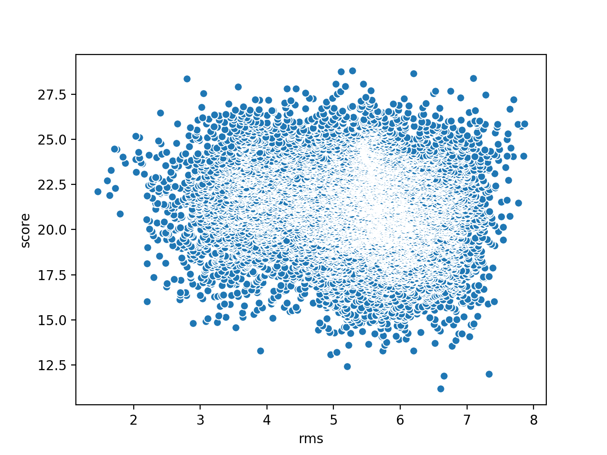
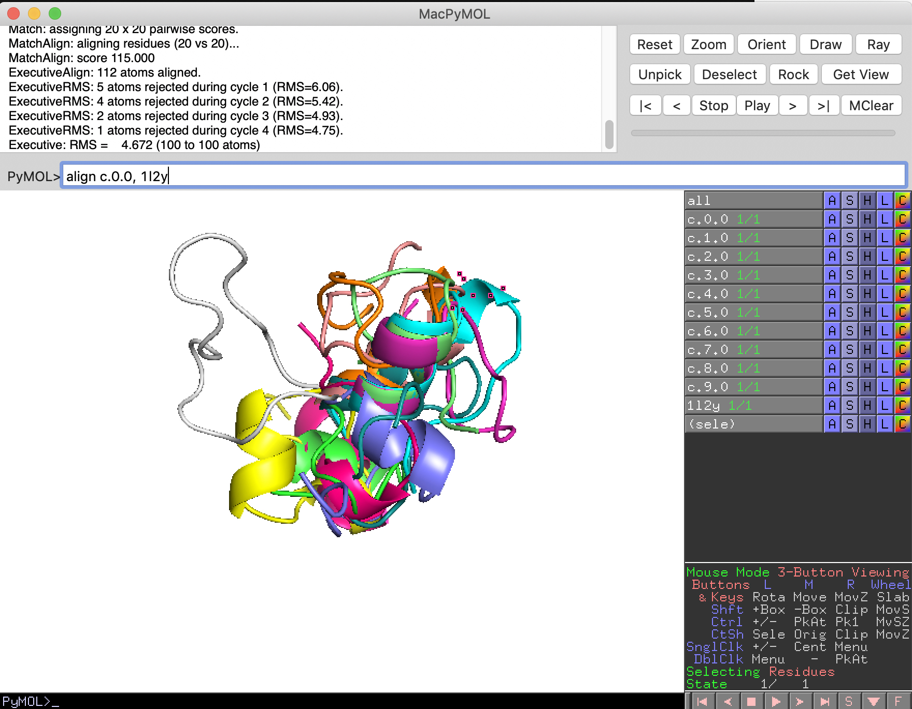
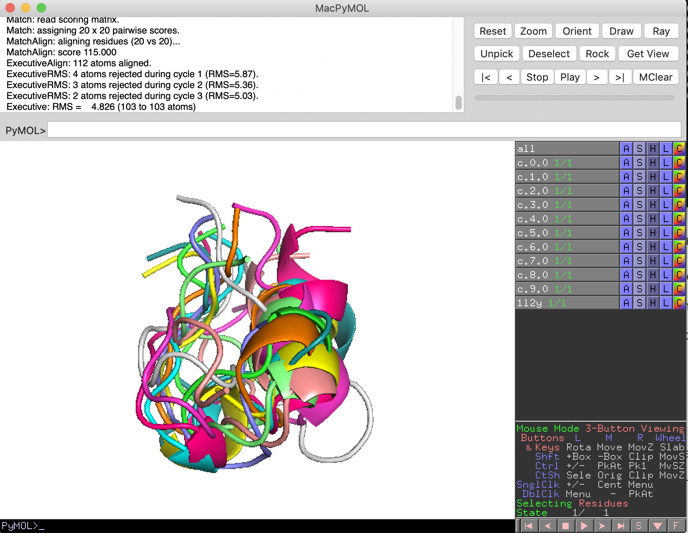
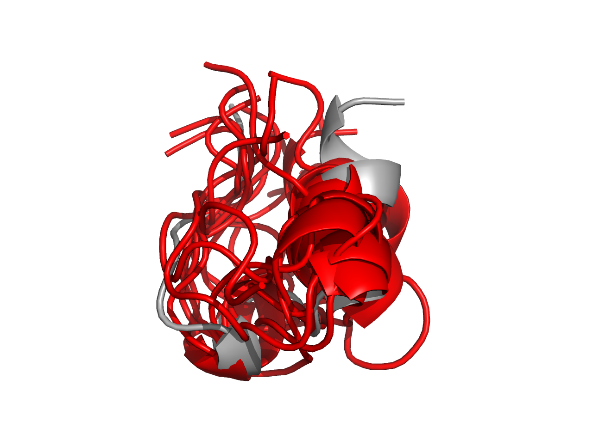

## Analyzing Rosetta runs 

Moving and untaring rosetta data from github repo

```shell
# transfer tarball of rosetta runs back to the cluster
$ scp rosetta_runs.tar.gz jyesselm@crane.unl.edu:/work/yesselmanlab/jyesselm/rosetta

# log on the cluster
$ cd $WORK
$ cd rosetta 
# remove old runs
$ rm -rf runs
# extract the tarball
$ tar -xvf rosetta_runs.tar.gz

```


### Generating energy "funnel" 

```shell
# concat all the score files together 
$ cat runs/*/score.fsc > score.fsc 

# sorts and only takes the 14th and 2nd row puts them in a new file 
$ sort -n -k2 score.fsc | awk '{print $14 "\," $2}' > score_rms.dat

# download file back to your home computer (open up another terminal)
$ scp jyesselm@crane.unl.edu:/work/yesselmanlab/jyesselm/rosetta/score_rms.dat .

# make sure to remove all the extra header statements and then plot it

```



Well you get the idea but not very funnel like ...


### clustering

```shell
# join 
combine_silent.default.linuxgccrelease runs/*/1l2y_silent.out -out:file:silent merged.out

# generate 10 clusters out of the 1000 predicted structures
$ cluster.default.linuxgccrelease -in:file:silent merged.out -cluster:limit_clusters 10

# download centroids for each cluster (in another terminal)
$ scp jyesselm@crane.unl.edu:/work/yesselmanlab/jyesselm/rosetta/c.*.0.pdb .

```

Open both all the centroids and original pdb in pymol

```shell
# on the mac you can do this in terminal like this
$ open c.*.pdb 1l2y.pdb  
```

Show all the models as cartoons, set the background to white

Lets align each model to the native pdb.

In the terminal part of pymol (see image below) type

align c.0.0, 1l2y

hit enter



This does a best rmsd structural alignment between the two models. 

Lets do this for all the models.

after all the alignments you should get something like this:



Lastly lets recolor the native gray and all the other models red 

We can ray trace this image and save it to a file by typing 

ray 1280; png test.png 

in the pymol command line




